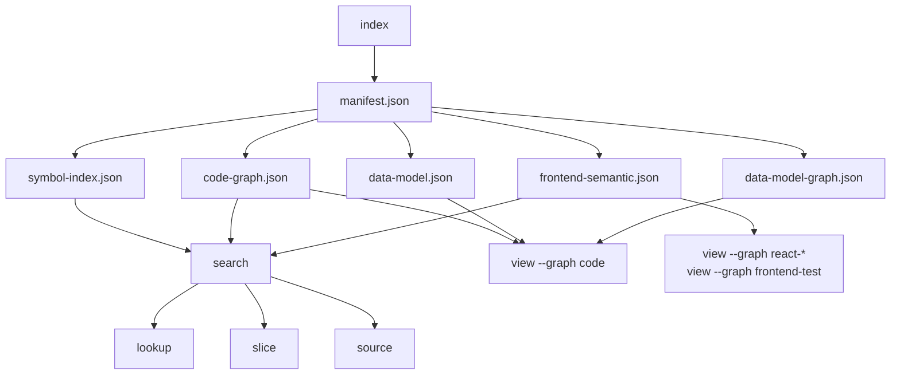

# my-dev-kit

my-dev-kit is a local-first CLI for indexing a codebase, exploring its graph, and retrieving bounded source evidence. It supports TypeScript, JavaScript, Python, Kotlin, Java, and supported Android project structures without editing source files or sending project data to an external service.

## Overview

Local codebase graph indexing produces deterministic, inspectable artifacts for files, symbols, frontend structures, supported data models, and Android static evidence. Use those artifacts to search the code graph, inspect exact nodes, retrieve focused source, trace supported static relationships, and prepare bounded context for downstream tools.

Everything runs locally. my-dev-kit does not call an LLM, make network requests, connect to a database, or edit source files.

## Installation

Use without installing globally:

```sh
npx @dailephd/my-dev-kit --help
npx @dailephd/my-dev-kit --version
```

Or install globally:

```sh
npm install -g @dailephd/my-dev-kit
```

## Quickstart

Run the CLI inside your own project:

```sh
cd <your-project>

npx @dailephd/my-dev-kit index --root . --src src --out .my-dev-kit --json
npx @dailephd/my-dev-kit search --index .my-dev-kit --query "service" --limit 20 --json
npx @dailephd/my-dev-kit lookup --index .my-dev-kit --node "<node-id>" --depth 1 --json
npx @dailephd/my-dev-kit slice --index .my-dev-kit --node "<node-id>" --depth 2 --direction both --json
npx @dailephd/my-dev-kit source --index .my-dev-kit --file "<path>" --symbol "<symbol-name>" --format numbered
npx @dailephd/my-dev-kit view --index .my-dev-kit --format dot --out .my-dev-kit/graph.dot
```



Re-run `index` to refresh artifacts when source changes:

```sh
npx @dailephd/my-dev-kit index --root . --src src --out .my-dev-kit --json
```

`index` refreshes the artifact directory in place. The normal artifact directory is `.my-dev-kit`. Custom `--out` paths remain supported.

Inspect data-model entities and fields:

```sh
npx @dailephd/my-dev-kit data-model --index .my-dev-kit --entity User --json
npx @dailephd/my-dev-kit data-model --index .my-dev-kit --field User.email --json
```

Trace supported static view usage:

```sh
npx @dailephd/my-dev-kit data-model --index .my-dev-kit --trace-view User --json
npx @dailephd/my-dev-kit data-model --index .my-dev-kit --field User.email --trace-view --json
```

## Commands

| Command | Purpose |
| --- | --- |
| `index` | Scan source roots, run semantic analyzers, and write index and semantic artifacts |
| `search` | Search indexed files, symbols, edges, and semantic roles by keyword |
| `lookup` | Look up a graph node by exact node ID, including semantic metadata |
| `source` | Retrieve bounded source by line range, symbol, node ID, exact string, or React region |
| `slice` | Build a bounded subgraph around a focus node, preserving semantic metadata |
| `view` | Render the code graph, data-model graph, lineage graph, or frontend semantic graphs as DOT, SVG, or PNG |
| `data-model` | Inspect exact entities or fields, or regenerate data-model artifacts and trace supported static view usage |
| `context` | Write a bounded, local, deterministic context capsule and optional retrieval audit for a query against an existing index |
| `graph-diff` | Compare two existing index directories and report added/removed/changed graph nodes, edges, and artifact metadata |

See [docs/COMMANDS.md](docs/COMMANDS.md) for the full flag reference.

For a guided introduction, see [docs/QUICKSTART.md](docs/QUICKSTART.md). The [example workflows](examples/README.md) provide small projects that you can run from a cloned repository.

## Graph-Guided Symbol Retrieval for LLM workflows

The recommended usage pattern for feeding bounded context to an LLM or coding agent is `search` → `lookup` → `slice` → `source`: narrow to a candidate with `search`, inspect the exact node and its relationships with `lookup`, pull a bounded neighborhood with `slice` when more relationship context is needed, then retrieve the bounded source text for the symbols that matter.

```sh
npx @dailephd/my-dev-kit search --index .my-dev-kit --query "user" --limit 20 --json
npx @dailephd/my-dev-kit lookup --index .my-dev-kit --node "<node-id>" --depth 1 --json
npx @dailephd/my-dev-kit slice --index .my-dev-kit --node "<node-id>" --depth 2 --direction both --json
npx @dailephd/my-dev-kit source --index .my-dev-kit --node "<node-id>" --format numbered
```

Compact prompt template for pasting the retrieved output into an LLM or coding-agent prompt:

```text
Task: <describe the change>
Repository context (from my-dev-kit, local static analysis only):
<paste search/lookup/slice/source JSON or numbered output here>
Instructions: use only the context above; do not assume behavior outside it.
```

For the full set of retrieval workflows (index → manifest → artifacts, search → lookup → slice → source with continuation and local expansion, data-model/lineage, context capsules, graph-diff, and Android/Kotlin/Java retrieval), see [docs/WORKFLOWS.md](docs/WORKFLOWS.md).

## Graph visualization example

Render the code graph and open it as an image:

```sh
npx @dailephd/my-dev-kit view --index .my-dev-kit --format dot --out .my-dev-kit/graph.dot
npx @dailephd/my-dev-kit view --index .my-dev-kit --format svg --out .my-dev-kit/graph.svg
npx @dailephd/my-dev-kit view --index .my-dev-kit --format png --out .my-dev-kit/graph.png
```

DOT output does not require Graphviz. SVG and PNG output require a local Graphviz installation (the `dot` binary on `PATH`); if Graphviz is not available, use the DOT output with any external Graphviz-compatible renderer instead.

## Latest release: v1.11.0

`@dailephd/my-dev-kit@1.11.0` is the latest published release. It adds Compose semantic retrieval, Android test semantic indexing, and bounded Compose/Android-test graph views. The command syntax and artifact schema major remain unchanged.

## v1.11.0 Compose and Android-test retrieval

v1.11.0 is the current published release. Package metadata and the CLI report `1.11.0`.

The implementation adds two conditional Android artifacts:

- `android-compose-semantic.json` (`my-dev-kit-v1-android-compose-semantic`, schema `1.2.0`) for conservative static composable declarations, child calls and UI regions, state/effect/ViewModel/UI-marker facts, and click/navigation-call evidence
- `android-test-semantic.json` (`my-dev-kit-v1-android-test-semantic`, schema `1.0.0`) for Android `test`/`androidTest` files, classes, methods, JUnit/Compose/Espresso/Robolectric evidence, assertions, routes, and test doubles

Compose evidence is projected into the existing `code-graph.json` as `android-composable` and `android-compose-fact` nodes. Android test evidence is projected as `android-test-file`, `android-test-class`, `android-test-method`, and `android-test-fact` nodes. The existing generic `search`, `lookup`, `source`, `slice`, `context`, and `graph-diff` paths consume these nodes; no second graph or retrieval engine is introduced.

The local development command surface adds exact Compose selectors and three bounded graph views:

```sh
node dist/cli.js source --index .my-dev-kit --composable HomeScreen --include-compose-tree --format numbered
node dist/cli.js source --index .my-dev-kit --android-ui "Welcome back" --format numbered
node dist/cli.js source --index .my-dev-kit --test-tag login_button --format numbered
node dist/cli.js slice --index .my-dev-kit --composable HomeScreen --include-viewmodel --include-navigation --json
node dist/cli.js view --index .my-dev-kit --graph compose-ui --format dot
node dist/cli.js view --index .my-dev-kit --graph compose-navigation --format dot
node dist/cli.js view --index .my-dev-kit --graph android-test --format dot
```

Matching is exact and ambiguity is preserved. All evidence is local, deterministic, read-only static analysis: it does not execute Gradle, Compose, tests, applications, or emulators; prove runtime UI visibility, click behavior, navigation, test success, or coverage; resolve rendered resource values; or provide the v1.12 Android architecture/data-flow capability. See [docs/COMMANDS.md](docs/COMMANDS.md), [docs/GRAPH_SCHEMA.md](docs/GRAPH_SCHEMA.md), and [docs/WORKFLOWS.md](docs/WORKFLOWS.md) for the complete release contract.

### Android capability introduced in v1.10.0

v1.10.0 extends the v1.9.0 Android foundation with conservative static Gradle, manifest, resource, navigation, relationship, retrieval, context, and graph-view evidence:

- static Android/Gradle project, module, and source-set detection, written to `android-project.json`
- conservative static Kotlin structural indexing for `.kt` files under indexed source roots
- conservative static Java structural indexing for `.java` files under indexed source roots
- conservative static Android component-role detection (Activity, Fragment, ViewModel, Service, BroadcastReceiver, ContentProvider, Worker, Repository, UseCase, Room Entity, Room DAO, Room Database, Retrofit service, Hilt/Dagger module), written to `android-components.json`
- Android component-role metadata surfaced through the existing `search`, `lookup`, `source`, `slice`, `context`, and `graph-diff` commands
- static Gradle project evidence in `android-gradle.json`; static manifest, resource, and navigation evidence in `android-manifest.json`, `android-resources.json`, and `android-navigation.json`
- compact Android relationship nodes and conservative candidate edges enriching `code-graph.json` (there is no `android-relationships.json`)
- exact Android route, permission, resource, and component retrieval through the existing `search`, `lookup`, `source`, `slice`, `context`, and `view` commands

For example:

```sh
npx @dailephd/my-dev-kit search --index .my-dev-kit --android-route home --json
npx @dailephd/my-dev-kit search --index .my-dev-kit --permission android.permission.CAMERA --json
npx @dailephd/my-dev-kit lookup --index .my-dev-kit --android-component com.example.MainActivity --json
npx @dailephd/my-dev-kit view --index .my-dev-kit --graph android-navigation --format dot
```

The shipped Android capability is static evidence, not runtime proof. It does not execute Gradle or start a Gradle daemon; resolve or download dependencies; build Android projects; run tests or emulators/devices; inspect APK/AAB files; perform signing, Play Store, App Links, or Android security validation; produce a final merged runtime manifest; select runtime resource overlays; or prove runtime UI, route, intent, or deep-link behavior. Android architecture classification and data-flow retrieval remain v1.12.0 scope.

## Stage-specific bounded context retrieval

Version 1.10.1 introduced this shipped capability by extending the existing `context` command and artifacts. It added `ContextRole` and `ContextRequest`, `context --request <path>`, `context --role <role>`, deterministic input normalization, role-aware and changed-surface evidence, responsibility mapping, adequacy, freshness, bounded fallback and truncation reporting, and provenance. The current package retains the v1.10.2 documentation corrections, the v1.10.3 implementation-role context readiness refinements, and v1.10.4 condition-aware adequacy without changing command syntax or schema major. See [docs/COMMANDS.md](docs/COMMANDS.md) for the complete command contract.

The patch separates three repository-evidence roles that have different freshness and evidence needs:

- **architecture** - locate likely owners, extension points, public contracts, graph neighbors, and architecture tests; answers "Where should the behavior live?"
- **implementation** - refresh immediately before production editing and retrieve exact owners, callers/callees, validators, constants, defaults, errors, serializers, schemas, compatibility surfaces, and closest tests; answers "What current code must change or be preserved?"
- **test-implementation** - refresh after production changes and focus on changed files/symbols, failure and side-effect boundaries, related tests, fixtures, factories, mocks, setup, configuration, commands, and explicit test-responsibility mappings; answers "How should approved test responsibilities be implemented against final production code?"

The additive structured `ContextRequest` is accepted through `context --request <request.json>` and supports focus files/symbols, caller-provided changed files/symbols, before/after index identities, requested evidence kinds, responsibility references, limits, output paths, and audit output. Results include graph-diff evidence, role-specific evidence groups, adequacy, freshness (`fresh`, `stale`, or `unknown`), truncation, unresolved evidence, and selection provenance. In v1.10.4, implementation output also includes role-condition witness coverage: general truncation may remain true while adequacy remains sufficient when the required owner and contract witnesses are retained. Existing `context` syntax and its `general`, `feature-add`, and `subsystem` modes remain compatible; role is a separate concept.

Ownership stays narrow:

- `my-dev-kit` owns deterministic local indexing and bounded repository-evidence retrieval, capsules, and retrieval audits.
- `my-dev-kit-orchestrator` v1.2.1 owns workflow/stage/command/rule/report-contract IDs, workflow dependency resolution, `WorkflowInstructionPacket`, TaskState, prompt assembly, stage order, lifecycle, judge handling, and manual stage freshness rules. The current orchestrator does not automatically run my-dev-kit; initial integration is prompt-guided.
- `my-dev-kit-lab` v0.4.3 owns controlled strategy evaluation, evidence recall/irrelevant inclusion, responsibility-mapping completeness, provenance/determinism/truncation evaluation, immutable targets, reports, plots, security validation, and code-rot auditing. It is not a production retrieval runtime.

The patch remains bounded, deterministic, inspectable, and honest: nonempty output is not automatically adequate; an existing index is not automatically fresh; free-form test prose is not automatically mapped; and every truncation or full-file fallback is reported. See [docs/ROADMAP.md](docs/ROADMAP.md), [docs/ARCHITECTURE.md](docs/ARCHITECTURE.md), [docs/COMMANDS.md](docs/COMMANDS.md), and [docs/WORKFLOWS.md](docs/WORKFLOWS.md) for the planning and command detail.

## Generated artifacts

The `index` command writes:

| Artifact | Contents |
| --- | --- |
| `manifest.json` | Artifact registry, analyzer registry and status, project metadata, artifact paths, and summary counts |
| `symbol-index.json` | Per-file symbol tables with locations, imports, exports, and compact semantic roles and classification roles per symbol |
| `code-graph.json` | Graph of file and symbol nodes connected by typed edges, with compact semantic roles and classification roles on symbol nodes |
| `call-graph.json` | Optional static call graph written when `--call-graph` is requested |
| `data-model.json` | Data entities, fields, relationships, source refs, and warnings, written when the TypeScript model analyzer runs |
| `data-model-graph.json` | Separate graph of data-model entity and field nodes, written when the TypeScript model analyzer runs |
| `frontend-semantic.json` | Frontend semantic artifact: React components, local components, prop types, hooks, handlers, JSX regions, test blocks, locators, UI strings, and flow relationships, written when the frontend analyzer runs on TSX/JSX files |
| `frontend-reachability.json` | Frontend reachability artifact (v1.3.0): static route facts, browser storage key facts, UI reachability facts, and cross-domain reachability edges, written when the frontend analyzer runs on TSX/JSX files |
| `classification.json` | Classification artifact (v1.5.0): conservative static schema/layer classification of files and symbols — category, edit guidance, readiness, risk labels, evidence, and uncertainty — written whenever the classification analyzer runs |
| `android-project.json` | Android project artifact (v1.9.0 Batch 1): static Android/Gradle project, module, and source-set detection — Kotlin/Java symbol data lives in `symbol-index.json`/`code-graph.json` instead (Batch 2/Batch 3) — written when Android evidence is found under `--root` |
| `android-components.json` | Android component-role artifact (v1.9.0 Batch 4): conservative static role detection (Activity/Fragment/ViewModel/Service/BroadcastReceiver/ContentProvider/Worker/Repository/UseCase/Room-Entity/Room-DAO/Room-Database/Retrofit-service/Hilt-module) over already-indexed Kotlin/Java top-level symbols — written only when at least one role is detected |
| `android-gradle.json` | Static Gradle settings, module, plugin, dependency, SDK, build-type, product-flavor, source-set, and version-catalog evidence; unsupported dynamic expressions remain warnings |
| `android-manifest.json` | Static source-set manifest declarations, components, permissions, features, intent filters, deep-link and launcher candidates, metadata, and resource references; no manifest merging |
| `android-resources.json` | Static resource directories, qualifiers, values/layout/file resources, IDs, references, and FileProvider/network-security records; no overlay selection or binary decoding |
| `android-navigation.json` | Static XML navigation graphs and narrow Compose route evidence, including destinations, actions, arguments, includes, deep links, candidates, and direct screen candidates; no runtime reachability proof |
| `android-compose-semantic.json` | v1.11.0 conservative Compose declarations and static state/effect/ViewModel/UI/click/navigation evidence; conditional on supported Compose evidence in a detected Android project |
| `android-test-semantic.json` | v1.11.0 Android unit/instrumented test structure and static JUnit/Compose/Espresso/Robolectric/assertion/route/test-double evidence; conditional on detected Android test source sets |

`manifest.json` is the authoritative registry for the current artifact set. Stale artifacts from previous runs are removed when `index` refreshes the directory.

Compact semantic roles (`semanticRoles`/`artifactRefs`) and compact classification roles (`classificationRoles`/`classificationRefs`) on symbol-index symbols and code-graph nodes link back to their respective detailed artifacts. The data-model, frontend semantic, and classification artifacts remain separate from `code-graph.json`, each with its own node/entry ID space.

`view` renders `code-graph.json` by default. Use `--graph data-model` or `--graph model-view-lineage` for data-model graphs. Use `--graph react-component`, `--graph react-flow`, `--graph react-prop-event-flow`, or `--graph frontend-test` for frontend semantic graphs. Graph artifacts remain separate; `view` does not merge semantic or lineage nodes into the code graph.

Android relationships enrich `code-graph.json` directly. Use `--graph android-module`, `--graph android-manifest`, or `--graph android-navigation` for the original Android views. v1.11.0 adds `--graph compose-ui`, `--graph compose-navigation`, and `--graph android-test`, all as bounded projections of that same code graph.

## Semantic integration

### v1.1 data-model semantic roles

The TypeScript model analyzer produces:

- `data-entity` roles on exported interfaces, type aliases, and classes that are classified as data models
- `data-field` roles on their properties

These compact roles are embedded in `symbol-index.json` and `code-graph.json` using `semanticRoles` and `artifactRefs` arrays on each symbol or node. `search`, `lookup`, `slice`, and `source` are all semantic-aware.

### v1.2 frontend semantic roles

The frontend analyzer runs on `.tsx` and `.jsx` files and produces a separate `frontend-semantic.json` artifact containing:

- Exported React components with source locations
- Local (non-exported) React components with source locations
- Prop type interfaces with source locations
- Hook blocks (useState, useEffect, and others) with source locations
- Event handlers with source locations
- JSX regions with source locations
- Frontend test blocks (describe, test, it), setup hooks, locators, route strings, and UI strings when test files are indexed

Frontend facts are not embedded into `code-graph.json` or `data-model.json`. They remain in `frontend-semantic.json` and are accessed through `source --react-region`, `source --include-local-component-tree`, and `view --graph react-*` or `view --graph frontend-test`.

## React/TSX indexing

When `index` encounters `.tsx` or `.jsx` files, the frontend analyzer extracts:

- Exported React components (function and arrow-function forms)
- Local (non-exported) React components used within the file
- Prop type interfaces and type aliases
- `useState` and `useEffect` hook blocks
- Event handlers and inline handlers
- JSX return regions
- Render helper local functions
- Important UI strings (`data-testid`, `aria-label`)

Results are written to `frontend-semantic.json` and registered in `manifest.json`.

Example:

```sh
npx @dailephd/my-dev-kit index --root . --src src --out .my-dev-kit --json
```

The `manifest.json` will include a `frontendSemantic` artifact path when TSX/JSX files are indexed.

## Frontend-test indexing

The frontend analyzer infrastructure supports extracting test facts from test files: `describe`/`test`/`it` block titles, setup/teardown hooks, locator expressions, and route-like strings. Test facts are included in `frontend-semantic.json` alongside component facts when present.

**Current limitation:** The base indexer excludes files matching `.test.` and `.spec.` patterns from default file discovery. Test files must be placed in a source root that the indexer processes and must not match these exclusion patterns. The `view --graph frontend-test` graph view produces output only when test files reach `frontend-semantic.json`.

## Exact source retrieval

Search for an exact string across all indexed source files:

```sh
npx @dailephd/my-dev-kit source --index .my-dev-kit --contains "workspace-editor-empty-state" --context 5 --format numbered
```

Filter by path prefix:

```sh
npx @dailephd/my-dev-kit source --index .my-dev-kit --contains "structured-content" --path src/components --context 3 --format json
```

Each match result includes:
- file path and line/column
- surrounding context lines
- match classification (`declaration-like`, `usage-like`, or `unknown`)
- frontend value context when the string appears in frontend facts

Multiple occurrences of the same literal across files are all reported.

## React region retrieval

Retrieve a named React region (component, hook, handler, JSX region, or prop type) by name:

```sh
npx @dailephd/my-dev-kit source --index .my-dev-kit --react-region WorkspaceEditorShell --file "src/WorkspaceEditorShell.tsx" --format numbered
```

The `--react-region` flag resolves the named region from the frontend semantic artifact and returns its source slice. JSON output includes a `reactRegion` metadata block with the matched kind, ID, and name.

## Local component-tree prop/event-flow retrieval

Retrieve a component and its local child components as a connected source bundle:

```sh
npx @dailephd/my-dev-kit source --index .my-dev-kit --symbol WorkspaceEditorShell --file "src/WorkspaceEditorShell.tsx" --include-local-component-tree --format numbered
```

Filter to a specific prop name:

```sh
npx @dailephd/my-dev-kit source --index .my-dev-kit --symbol WorkspaceEditorShell --file "src/WorkspaceEditorShell.tsx" --include-local-component-tree --prop onSuccess --format numbered
```

This feature uses statically extracted prop and event flow relationships between the parent component and its local child components. It is static analysis only — it does not trace runtime rendering behavior, route reachability, or browser-state behavior.

## Frontend graph views

Render a static React component graph (components, local components, prop types, and their structural relationships):

```sh
npx @dailephd/my-dev-kit view --index .my-dev-kit --graph react-component --format dot --out .my-dev-kit/react-component.dot
```

Render all frontend flow facts (hooks, handlers, JSX regions, and flow relationships):

```sh
npx @dailephd/my-dev-kit view --index .my-dev-kit --graph react-flow --format dot --out .my-dev-kit/react-flow.dot
```

Render only prop and event flow relationships:

```sh
npx @dailephd/my-dev-kit view --index .my-dev-kit --graph react-prop-event-flow --format dot --out .my-dev-kit/react-prop-event-flow.dot
```

Render frontend test structure (test files, describe blocks, test/it blocks, setup hooks, locators, route strings):

```sh
npx @dailephd/my-dev-kit view --index .my-dev-kit --graph frontend-test --format dot --out .my-dev-kit/frontend-test.dot
```

DOT output does not require Graphviz. All four graph views are backed by the same `frontend-semantic.json` artifact and are rendered at command time from static extracted facts. They do not claim runtime rendering behavior, route reachability, or browser-state behavior.

## Frontend Reachability (v1.3.0)

my-dev-kit records static evidence connecting routes, components, UI markers, browser storage keys, and tests. When `index` runs the frontend analyzer on `.tsx`/`.jsx` files, it also writes a `frontend-reachability.json` artifact that links:

- static route paths (React Router `path`/`to`/`href`, Next.js `pages/` convention, test-mentioned routes) to their owning components
- browser storage keys (`localStorage`/`sessionStorage`/`cookie` with static string keys) to the components and `useState` gates that use them
- UI markers (`data-testid`, `aria-label`, visible text, `placeholder`, `aria-labelledby`) to their components, JSX condition gates, and any matching test locators

Every fact carries a static confidence (`high`/`medium`/`low`) and warnings for dynamic or unresolved values. This is conservative static analysis: it records what the source text contains. It does not execute the app, run the browser, prove a route is reachable by any user, or prove a UI element is visible at runtime.

`search`, `lookup`, `slice`, and `source` accept `--route`, `--storage-key`, and `--ui` selectors, and `view` adds three reachability graph views:

```sh
# Find a route fact and its related components, storage keys, and UI markers
npx @dailephd/my-dev-kit search --index .my-dev-kit --route "/workspaces/new" --json
npx @dailephd/my-dev-kit search --index .my-dev-kit --storage-key "workspace-editor-draft.v1" --json
npx @dailephd/my-dev-kit search --index .my-dev-kit --ui "workspace-editor-empty-state" --json

# Look up a single reachability fact and its depth-1 neighbors
npx @dailephd/my-dev-kit lookup --index .my-dev-kit --route "/workspaces/new" --json
npx @dailephd/my-dev-kit lookup --index .my-dev-kit --storage-key "workspace-editor-draft.v1" --json
npx @dailephd/my-dev-kit lookup --index .my-dev-kit --ui "workspace-editor-empty-state" --json

# Slice a cross-domain subgraph rooted at a route, pulling in storage, UI, and test evidence
npx @dailephd/my-dev-kit slice --index .my-dev-kit --route "/workspaces/new" --include-storage --include-ui --include-tests --json

# Retrieve the bounded source where a route/storage-key/UI marker is defined
npx @dailephd/my-dev-kit source --index .my-dev-kit --route "/workspaces/new" --format numbered
npx @dailephd/my-dev-kit source --index .my-dev-kit --storage-key "workspace-editor-draft.v1" --format numbered
npx @dailephd/my-dev-kit source --index .my-dev-kit --ui "workspace-editor-empty-state" --format numbered

# Render reachability graph views (DOT does not require Graphviz)
npx @dailephd/my-dev-kit view --index .my-dev-kit --graph route --format dot --out .my-dev-kit/route.dot
npx @dailephd/my-dev-kit view --index .my-dev-kit --graph browser-storage --format dot --out .my-dev-kit/browser-storage.dot
npx @dailephd/my-dev-kit view --index .my-dev-kit --graph ui-reachability --format dot --out .my-dev-kit/ui-reachability.dot
```

See [docs/COMMANDS.md](docs/COMMANDS.md) for the full reachability flag reference.

## Source continuation (v1.4.0)

When the first bounded source result is not enough, continue reading without defaulting to a whole-file read.

```sh
# Continue a file from an explicit line
npx @dailephd/my-dev-kit source --index .my-dev-kit --file src/editor.ts --continue-from 21

# Continue from the end of a symbol's initial preview
npx @dailephd/my-dev-kit source --index .my-dev-kit --file src/editor.ts --symbol EditorShell --continue

# Continue from the end of a node's initial preview
npx @dailephd/my-dev-kit source --index .my-dev-kit --node "symbol:src/editor.ts#EditorShell" --continue
```

JSON output always includes a `continuationCursor` with `nextStartLine`, `previousEndLine`, `exhausted`, and `reason`. Numbered output prints a `[CONTINUE: ...]` or `[EOF: ...]` footer.

## Local dependency expansion (v1.4.0)

Retrieve a primary symbol and the same-file definitions it directly depends on as a bounded, structured bundle.

```sh
# Include same-file types and helpers (composite flag)
npx @dailephd/my-dev-kit source --index .my-dev-kit --file src/editor.ts --symbol EditorShell --include-local-deps --format numbered

# Include prop types (uses frontend-semantic when available for exact end lines)
npx @dailephd/my-dev-kit source --index .my-dev-kit --file src/editor.tsx --symbol EditorShell --include-props --format numbered

# Include locally rendered child components
npx @dailephd/my-dev-kit source --index .my-dev-kit --file src/editor.tsx --symbol EditorShell --include-local-components --format numbered

# Include local import lines (external packages go to skippedBlocks)
npx @dailephd/my-dev-kit source --index .my-dev-kit --file src/editor.ts --symbol EditorShell --include-imports --format numbered

# Cap bundle size
npx @dailephd/my-dev-kit source --index .my-dev-kit --file src/editor.ts --symbol EditorShell --include-local-deps --max-bundle-lines 150 --max-blocks 8 --format json
```

Bundle output (`--format json`) includes `primaryBlock`, `expansionBlocks` (each with `kind`, `expansionReasons`, `confidence`, `dedupeKey`), `skippedBlocks` (with `reasonCode` and human reason), `limits`, `stats`, and `continuationCursors`.

Numbered output prints a block header before each block:

```
=== [local-type] src/editor.ts:3-7 (5 lines) — local-type ===
```

Expansion is static-analysis only: direct, same-file dependencies. No cross-file closure, no runtime tracing, no browser execution.

## Data-model extraction

Supported extraction patterns:

- exported interfaces with property signatures
- exported type aliases whose right side is an object literal type
- exported classes with property declarations

Supported inspection behavior:

- exact entity lookup by name or stable ID
- exact field lookup by `Entity.field`
- conservative static `trace-view` output for supported same-project evidence

The `data-model` command is available for focused inspection and regeneration of data-model artifacts. It reads index artifacts from `--index` and can regenerate or inspect without re-running `index`.

Unsupported or ambiguous patterns are reported as warnings or omitted conservatively. The current release does not claim Prisma, SQL, Django, SQLAlchemy, TypeORM, or Sequelize support.

## Conservative model-to-view lineage

`trace-view` is a static evidence feature, not a runtime UI tracer.

Supported lineage is intentionally narrow. It can connect supported data-model fields through:

- direct transformation functions that return object literals from model field reads
- direct view-model property assignments from known model fields
- direct component prop assignments when field identity remains explicit
- direct JSX rendering when field identity remains explicit

It does not claim:

- route-aware reachability
- browser-state behavior
- full React render-flow tracing
- runtime rendering behavior

## Trying the bundled examples from a cloned repository

The bundled examples are useful when you cloned this repository, are inspecting package contents, or want a small smoke-test project.

TypeScript graph example:

```sh
npx @dailephd/my-dev-kit index --root examples/basic-ts --src src --out .my-dev-kit --call-graph --json
npx @dailephd/my-dev-kit search --index examples/basic-ts/.my-dev-kit --query "user" --limit 5 --json
npx @dailephd/my-dev-kit lookup --index examples/basic-ts/.my-dev-kit --node symbol:src/index.ts#describeUser --depth 1 --json
```

Data-model example:

```sh
npx @dailephd/my-dev-kit index --root examples/basic-data-model-ts --src src --out .my-dev-kit --json
npx @dailephd/my-dev-kit data-model --index examples/basic-data-model-ts/.my-dev-kit --entity User --json
npx @dailephd/my-dev-kit data-model --index examples/basic-data-model-ts/.my-dev-kit --field User.email --json
npx @dailephd/my-dev-kit data-model --index examples/basic-data-model-ts/.my-dev-kit --trace-view User --json
npx @dailephd/my-dev-kit view --index examples/basic-data-model-ts/.my-dev-kit --graph data-model --format dot --out examples/basic-data-model-ts/.my-dev-kit/data-model.dot
```

React/TSX example:

```sh
npx @dailephd/my-dev-kit index --root examples/basic-react-tsx --src src --out .my-dev-kit --json
npx @dailephd/my-dev-kit source --index examples/basic-react-tsx/.my-dev-kit --contains "workspace-editor-empty-state" --context 5 --format numbered
npx @dailephd/my-dev-kit view --index examples/basic-react-tsx/.my-dev-kit --graph react-component --format dot --out examples/basic-react-tsx/.my-dev-kit/react-component.dot
```

See [examples/README.md](examples/README.md) for more detail.

## Design boundaries

my-dev-kit is a local, deterministic read-only CLI tool. It does not:

- make network requests or LLM calls
- edit or modify source files
- perform semantic similarity search or embedding-based retrieval
- execute user application code
- connect to databases
- claim runtime React or browser-state behavior
- prove route reachability at runtime
- prove UI visibility at runtime
- execute Android unit or instrumented tests, Compose, Gradle, an application, or an emulator

All React/TSX and frontend-test analysis is conservative static extraction from source text. The frontend semantic artifact records what the static analyzer found in the source; it does not prove what the application renders at runtime.

## Limitations

- Symbol end lines are not stored in the symbol index. Symbol source retrieval returns a capped preview from the symbol's start line. v1.4 uses the `frontend-semantic.json` artifact (when available) or a next-symbol heuristic to estimate end lines; confidence is reported per block. Use `--continue-from <n>` or `--continue` to retrieve subsequent windows.
- Call-graph extraction is best-effort static syntactic analysis and may miss dynamic dispatch, computed calls, monkey-patching, decorator effects, and runtime behavior.
- Data-model extraction is conservative and currently focused on supported TypeScript patterns.
- Frontend semantic extraction is conservative. Dynamic component registrations, runtime-composed JSX, and computed prop names may not be extracted or may be partially extracted with warnings.
- Semantic roles currently produced: `data-entity` and `data-field` from the TypeScript model analyzer. Frontend facts are in `frontend-semantic.json`, not embedded as `semanticRoles` in the code graph.
- Lookup is exact only. There is no fuzzy entity, field, or component lookup.
- `trace-view` is conservative static analysis only. Unsupported dynamic or ambiguous patterns are warned or omitted.
- Route-aware retrieval, browser-storage tracing, and UI reachability analysis (v1.3.0) record static evidence only. They do not execute the app, run the browser, prove a route is reachable by any user, or prove a UI element is visible at runtime.

## Development from source

```sh
npm install
npm run build
```

Validate:

```sh
npm run typecheck
npm run test
npm run verify
```

See [docs/DEVELOPMENT.md](docs/DEVELOPMENT.md) for the development guide and [docs/RELEASE.md](docs/RELEASE.md) for the maintainer release checklist.

## Roadmap

Version 1.11.0 is the latest published release. Later versions retain their separate planned scopes: v1.12.0 Android architecture/data-flow evidence, v1.13.0 Android retrieval benchmarks/examples/workflow documentation, and the longer-term v1.14.0 and v2.0.0 plans. Historical release details and deferred v1.8.0 work remain in the canonical [roadmap](docs/ROADMAP.md) and [changelog](CHANGELOG.md).

## Support the project

my-dev-kit is independently developed and maintained by dailephd / dailephd LLC.

If the project helps your work, you can optionally support continued development through:

- GitHub Sponsors: https://github.com/sponsors/dailephd
- PayPal: https://paypal.me/daile88

Support is appreciated, but not required. The project remains usable under its published license.

## Bug reports

Open an issue in the project repository with a description of the finding and a reproduction case.

## License

MIT. Copyright (c) 2026 dailephd LLC.

See [LICENSE](LICENSE) for the full license text.
