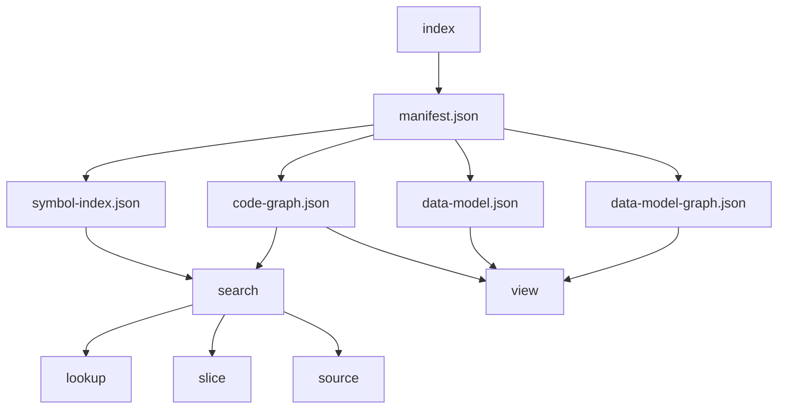

# my-dev-kit

Local codebase graph indexing, semantic enrichment, bounded source retrieval, data-model extraction, and conservative static model-to-view lineage for TypeScript, JavaScript, and Python projects.

## Overview

my-dev-kit helps you navigate a local project by building deterministic artifacts for files, symbols, and supported data models, and by enriching those artifacts with compact semantic role metadata. You can search the code graph including semantic roles, inspect exact nodes with semantic context, retrieve bounded source, generate data-model artifacts, inspect exact entities and fields, and trace supported static model-to-view paths.

Everything runs locally. my-dev-kit does not call an LLM, make network requests, connect to a database, or edit source files.

## Installation

```sh
npm install -g @dailephd/my-dev-kit
```

Confirm:

```sh
my-dev-kit --help
my-dev-kit --version
```

## Quickstart

Run the CLI inside your own project:

```sh
cd <your-project>

my-dev-kit index --root . --src src --out .my-dev-kit --json
my-dev-kit search --index .my-dev-kit --query "service" --limit 20 --json
my-dev-kit lookup --index .my-dev-kit --node "<node-id>" --depth 1 --json
my-dev-kit slice --index .my-dev-kit --node "<node-id>" --depth 2 --direction both --json
my-dev-kit source --index .my-dev-kit --file "<path>" --symbol "<symbol-name>" --format numbered
my-dev-kit view --index .my-dev-kit --format dot --out .my-dev-kit/graph.dot
my-dev-kit view --index .my-dev-kit --graph data-model --format dot --out .my-dev-kit/data-model.dot
```



Re-run `index` to refresh artifacts when source changes:

```sh
my-dev-kit index --root . --src src --out .my-dev-kit --json
```

`index` refreshes the artifact directory in place. The normal artifact directory is `.my-dev-kit`. Custom `--out` paths remain supported.

Inspect data-model entities and fields from the generated artifacts:

```sh
my-dev-kit data-model --index .my-dev-kit --entity User --json
my-dev-kit data-model --index .my-dev-kit --field User.email --json
```

Trace supported static view usage:

```sh
my-dev-kit data-model --index .my-dev-kit --trace-view User --json
my-dev-kit data-model --index .my-dev-kit --field User.email --trace-view --json
```

## Commands

| Command | Purpose |
| --- | --- |
| `index` | Scan source roots, run semantic analyzers, and write index and semantic artifacts |
| `search` | Search indexed files, symbols, edges, and semantic roles by keyword |
| `lookup` | Look up a graph node by exact node ID, including semantic metadata |
| `source` | Retrieve bounded source by line range, symbol, or node ID |
| `slice` | Build a bounded subgraph around a focus node, preserving semantic metadata |
| `view` | Render the code graph, data-model graph, or model-view-lineage graph as DOT, SVG, or PNG |
| `data-model` | Inspect exact entities or fields, or regenerate data-model artifacts and trace supported static view usage |

See [docs/COMMANDS.md](docs/COMMANDS.md) for the full flag reference.

## Generated artifacts

The `index` command writes:

| Artifact | Contents |
| --- | --- |
| `manifest.json` | Artifact registry, analyzer registry and status, project metadata, artifact paths, and summary counts |
| `symbol-index.json` | Per-file symbol tables with locations, imports, exports, and compact semantic roles per symbol |
| `code-graph.json` | Graph of file and symbol nodes connected by typed edges, with compact semantic roles on symbol nodes |
| `call-graph.json` | Optional static call graph written when `--call-graph` is requested |
| `data-model.json` | Data entities, fields, relationships, source refs, and warnings, written when the TypeScript model analyzer runs |
| `data-model-graph.json` | Separate graph of data-model entity and field nodes, written when the TypeScript model analyzer runs |

`manifest.json` is the authoritative registry for the current artifact set. Stale artifacts from previous runs are removed when `index` refreshes the directory.

Compact semantic roles on symbol-index symbols and code-graph nodes link back to the detailed artifacts through `artifactRefs`. The `data-model.json` and `data-model-graph.json` artifacts remain separate from `code-graph.json`.

`view` renders `code-graph.json` by default. Use `--graph data-model` to render `data-model-graph.json`, or `--graph model-view-lineage` after `data-model --trace-view` has produced lineage. The graph artifacts remain separate; `view` does not merge semantic or lineage nodes into the code graph.

## Semantic integration

Version 1.1.0 adds semantic role metadata on top of the existing index artifacts.

The `index` command runs semantic analyzers as part of the index run. The TypeScript model analyzer currently produces:

- `data-entity` roles on exported interfaces, type aliases, and classes that are classified as data models
- `data-field` roles on their properties

These compact roles are embedded in `symbol-index.json` and `code-graph.json` using `semanticRoles` and `artifactRefs` arrays on each symbol or node. `search`, `lookup`, `slice`, and `source` are all semantic-aware: they index, return, preserve, or propagate these fields when present.

Additional semantic roles are defined in the schema (`route-handler`, `react-component`, `view-model`, and others) but are not yet produced by current analyzers. See [docs/ROADMAP.md](docs/ROADMAP.md) for the planned expansion.

## Data-model extraction

Supported extraction patterns:

- exported interfaces with property signatures
- exported type aliases whose right side is an object literal type
- exported classes with property declarations

Supported inspection behavior:

- exact entity lookup by name or stable ID
- exact field lookup by `Entity.field`
- conservative static `trace-view` output for supported same-project evidence

The `data-model` command is available for focused inspection and regeneration of data-model artifacts. It reads index artifacts from `--index` and can regenerate or inspect without re-running `index`.

Unsupported or ambiguous patterns are reported as warnings or omitted conservatively. The current release does not claim Prisma, SQL, Django, SQLAlchemy, TypeORM, or Sequelize support.

## Conservative model-to-view lineage

`trace-view` is a static evidence feature, not a runtime UI tracer.

Supported lineage is intentionally narrow. It can connect supported data-model fields through:

- direct transformation functions that return object literals from model field reads
- direct view-model property assignments from known model fields
- direct component prop assignments when field identity remains explicit
- direct JSX rendering when field identity remains explicit

It does not claim:

- route-aware reachability
- browser-state behavior
- full React render-flow tracing
- runtime rendering behavior

## Trying the bundled examples from a cloned repository

The bundled examples are useful when you cloned this repository, are inspecting package contents, or want a small smoke-test project.

TypeScript graph example:

```sh
my-dev-kit index --root examples/basic-ts --src src --out .my-dev-kit --call-graph --json
my-dev-kit search --index examples/basic-ts/.my-dev-kit --query "user" --limit 5 --json
my-dev-kit lookup --index examples/basic-ts/.my-dev-kit --node symbol:src/index.ts#describeUser --depth 1 --json
```

Data-model example:

```sh
my-dev-kit index --root examples/basic-data-model-ts --src src --out .my-dev-kit --json
my-dev-kit data-model --index examples/basic-data-model-ts/.my-dev-kit --entity User --json
my-dev-kit data-model --index examples/basic-data-model-ts/.my-dev-kit --field User.email --json
my-dev-kit data-model --index examples/basic-data-model-ts/.my-dev-kit --trace-view User --json
my-dev-kit data-model --index examples/basic-data-model-ts/.my-dev-kit --field User.email --trace-view --json
my-dev-kit view --index examples/basic-data-model-ts/.my-dev-kit --graph data-model --format dot --out examples/basic-data-model-ts/.my-dev-kit/data-model.dot
my-dev-kit view --index examples/basic-data-model-ts/.my-dev-kit --graph model-view-lineage --format dot --out examples/basic-data-model-ts/.my-dev-kit/lineage.dot
```

See [examples/README.md](examples/README.md) for more detail.

## Design boundaries

my-dev-kit is a local, deterministic read-only CLI tool. It does not:

- make network requests or LLM calls
- edit or modify source files
- perform semantic similarity search or embedding-based retrieval
- execute user application code
- connect to databases
- claim runtime React or browser-state behavior

## Limitations

- Symbol end lines are not recorded during indexing. Symbol source retrieval returns a capped preview from the symbol's start line with a warning. Use explicit line ranges for exact bounds.
- Call-graph extraction is best-effort static syntactic analysis and may miss dynamic dispatch, computed calls, monkey-patching, decorator effects, and runtime behavior.
- Data-model extraction is conservative and currently focused on supported TypeScript patterns.
- Semantic roles currently produced: `data-entity` and `data-field` from the TypeScript model analyzer. Other defined roles are planned for future releases.
- Lookup is exact only. There is no fuzzy entity or field lookup.
- `trace-view` is conservative static analysis only. Unsupported dynamic or ambiguous patterns are warned or omitted.

## Development from source

```sh
npm install
npm run build
```

Validate:

```sh
npm run typecheck
npm run test
npm run verify
```

See [docs/DEVELOPMENT.md](docs/DEVELOPMENT.md) for the development guide and [docs/RELEASE.md](docs/RELEASE.md) for the maintainer release checklist.

## Roadmap

Version 1.1.0 adds the first semantic integration layer: semantic roles on index artifacts, manifest as authoritative artifact registry, analyzer registry and status, data-model and model-to-view lineage artifacts linked from the index, and semantic-aware search, lookup, slice, and source. Future roadmap items cover broader semantic role coverage, React and route-aware analysis, source expansion, graph rendering improvements, and scalability.

See [docs/ROADMAP.md](docs/ROADMAP.md) for the full roadmap.

## Support the project

my-dev-kit is independently developed and maintained by dailephd / dailephd LLC.

If the project helps your work, you can optionally support continued development through:

- GitHub Sponsors: https://github.com/sponsors/dailephd
- PayPal: https://paypal.me/daile88

Support is appreciated, but not required. The project remains usable under its published license.

## Bug reports

Open an issue in the project repository with a description of the finding and a reproduction case.

## License

MIT. Copyright (c) 2026 dailephd LLC.

See [LICENSE](LICENSE) for the full license text.
