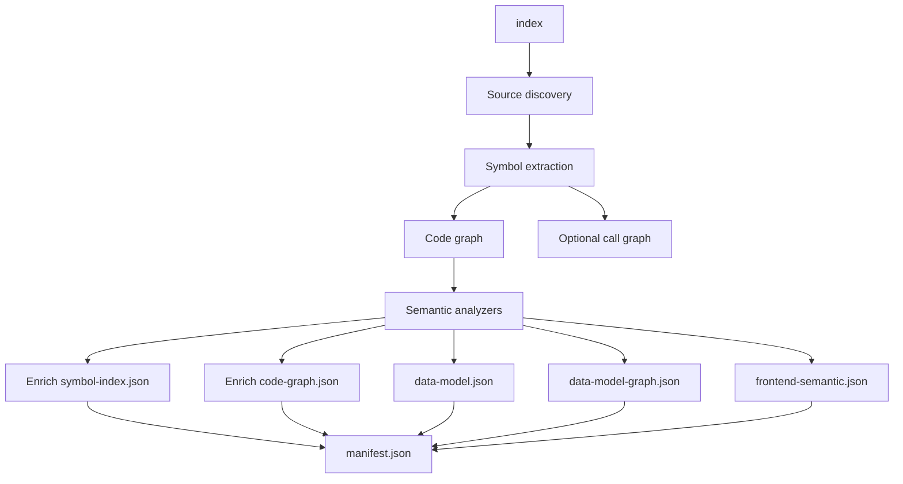

# Architecture

## System goal

my-dev-kit provides deterministic, offline code graph indexing, semantic enrichment, bounded source retrieval, React/TSX and frontend-test indexing, downstream data-model extraction, conservative static model-to-view lineage, incremental indexing with read-only graph comparison, bounded context-capsule retrieval, and conservative static Android project/component detection with Kotlin and Java structural indexing, for TypeScript, JavaScript, Python, Kotlin, and Java projects.

The system produces local JSON artifacts that can be inspected, searched, sliced, rendered, and reused by developers or coding agents. It does not run a server, call LLMs, call external APIs, execute user source code, or modify source files.

## High-level architecture

```text
CLI entry: src/cli.ts
  |
  +-- index command       -> Indexing layer
  |                        -> Symbol extraction, code graph, optional call graph
  |                        -> Semantic analyzer layer
  |                        -> manifest.json (artifact registry, analyzer registry)
  |                        -> symbol-index.json (symbols with compact semanticRoles, artifactRefs)
  |                        -> code-graph.json (nodes with compact semanticRoles, artifactRefs)
  |                        -> call-graph.json (optional)
  |                        -> data-model.json (when TypeScript model analyzer runs)
  |                        -> data-model-graph.json (when TypeScript model analyzer runs)
  |                        -> frontend-semantic.json (when frontend analyzer runs on TSX/JSX files)
  |
  +-- search command      -> Searches structural and semantic fields in index artifacts
  +-- lookup command      -> Exact node lookup, returns semantic metadata when present
  +-- source command      -> Bounded source retrieval, propagates semantic metadata;
  |                          exact string search (--contains), React region retrieval (--react-region),
  |                          local component-tree retrieval (--include-local-component-tree)
  +-- slice command       -> Graph slicing, preserves semantic metadata on nodes
  +-- view command        -> Graph view layer (code/data-model/lineage/frontend-semantic graph artifacts)
  |
  +-- data-model command  -> Data-model inspection and regeneration layer
  |                        -> data-model.json
  |                        -> data-model-graph.json
  |                        -> model-view-lineage.json (trace-view mode)
  |
  +-- context command     -> Context capsule layer (v1.6.0)
  |                        -> context-capsule.json
  |                        -> retrieval-audit-record.json (optional, --audit-out)
  |
  +-- graph-diff command  -> Graph comparison layer (v1.8.0)
                           -> deterministic, read-only comparison of two index directories
```

`index` also runs, as of v1.9.0, static Android project detection and Kotlin/Java structural indexing:

```text
  index command (continued)
    -> Android detection layer  -> android-project.json (when Android evidence found)
    -> Kotlin/Java adapters     -> symbol-index.json / code-graph.json (participate like any language)
    -> Android component-role layer -> android-components.json (when roles detected)
```



The `index` command is the primary entry point. It builds the structural index, runs semantic analyzers, enriches the index artifacts with compact semantic metadata, writes all produced artifacts, and updates `manifest.json` as the authoritative registry.

Downstream data-model, lineage, and frontend semantic layers consume existing index artifacts instead of replacing the indexer. The `data-model` command is a focused inspection and regeneration command for data-model artifacts. Frontend semantic facts are consumed by `source` (exact match, React region, local component-tree) and `view --graph react-*` or `view --graph frontend-test`.

## Index-first architecture

`index` is the primary workflow command. Re-running it refreshes the artifact directory in place.

The managed artifact model works as follows:

1. `index` runs the full build: source discovery, language extraction, symbol index, code graph, optional call graph.
2. `index` runs semantic analyzers on the build output.
3. Semantic results are used to enrich the symbol index and code graph with compact role metadata.
4. `index` writes all produced artifacts to the output directory.
5. `index` removes artifacts from the previous run that were not produced in the current run.
6. `index` writes `manifest.json` last, recording which artifacts are present and the status of each analyzer.

`manifest.json` is always the authoritative registry. Consumers should read `manifest.json` to determine which artifacts are current rather than assuming fixed file names are always present.

## Artifact model

The system has four artifact layers.

### Structural artifacts

- `manifest.json` — artifact registry, analyzer registry, project metadata
- `symbol-index.json` — per-file symbol tables with compact semantic roles and compact classification roles
- `code-graph.json` — file and symbol graph with compact semantic roles and compact classification roles on symbol nodes
- `call-graph.json` — optional static call graph

These artifacts describe source files, symbols, edges, and optional static call relationships. They carry compact semantic role metadata (`semanticRoles`, `artifactRefs`) and compact classification metadata (`classificationRoles`, `classificationRefs`, v1.5.0) when analyzers produce it.

### Semantic artifacts

- `data-model.json` — entities, fields, relationships, evidence, and warnings
- `data-model-graph.json` — derived semantic graph of data-model entities and fields

These artifacts carry detailed semantic records. They are separate from `code-graph.json` and use their own node and edge ID space.

`data-model-graph.json` is a derived semantic graph, not a slice of `code-graph.json`. The code graph describes static source structure. The data-model graph describes data entities and fields extracted by the TypeScript model analyzer.

### Lineage artifact

- `model-view-lineage.json` — conservative static relationships between data-model fields, transformations, view-model fields, component props, and rendered fields

This artifact is built by `data-model --trace-view`. It is separate from both the code graph and the data-model graph.

### Frontend semantic artifact

- `frontend-semantic.json` — React component facts, local component facts, prop type facts, hook blocks, event handlers, JSX regions, test blocks, locators, route strings, UI strings, and statically extracted flow relationships between them

This artifact is built by the frontend analyzer during `index` when `.tsx`, `.jsx`, or test files are found. It is separate from `code-graph.json`, `data-model.json`, and `model-view-lineage.json`.

The frontend semantic artifact is consumed by:
- `source --contains` (exact string search, uses symbol-index.json but enriches results with frontend context)
- `source --react-region` (React region lookup by name)
- `source --include-local-component-tree` (local component-tree retrieval using flow relationships)
- `view --graph react-component`, `view --graph react-flow`, `view --graph react-prop-event-flow`, `view --graph frontend-test` (static graph rendering)

Frontend facts are not embedded into `code-graph.json` or `symbol-index.json`. The code graph remains focused on static source structure. Frontend facts live in their own artifact and are accessed through dedicated `source` flags or `view --graph` choices.

The bridge between structural and semantic artifacts is `artifactRefs` (links from compact symbol metadata to detailed artifact entries) and `evidenceRefs` (source location evidence attached to semantic roles).

### Classification artifact (v1.5.0)

- `classification.json` — conservative static schema/layer classification of files and symbols: category assignments, edit guidance, readiness, risk labels, evidence, and uncertainty

This artifact is built by the classification analyzer during `index`, after the data-model, frontend, and frontend-reachability analyzers run (their output is used as evidence where available). It is registered under the generic `'classification'` analyzer entry in `manifest.json`'s `analyzers` array — not under `semanticArtifacts`, which remains a fixed set of five pre-v1.5.0 artifacts.

Classification follows the same two-tier pattern as `data-model.json`/`frontend-semantic.json`: `classification.json` holds detailed entries (category, edit guidance, readiness, risk labels, evidence, uncertainty, warnings), while a compact projection (`classificationRoles`, `classificationRefs`) is embedded on symbol nodes in `symbol-index.json` and `code-graph.json`, mirroring exactly how `semanticRoles`/`artifactRefs` are embedded. `classificationRoles`/`classificationRefs` are new, separate fields — they do not overload or change the meaning of `semanticRoles`/`artifactRefs`.

Classification is static and conservative: categories are only assigned when file/path/naming conventions or existing semantic evidence (data-model roles, frontend-reachability facts) support them. It never claims runtime, browser, or database behavior, and it reuses existing category names from `SemanticRoleName` where one already exists, to avoid vocabulary drift between semantic roles and classification.

`classification.json` absence (an older index, or a classification analyzer failure) does not change any other artifact's shape or values, and does not break `search`/`lookup`/`slice`/`source` — this mirrors how `frontend-semantic.json`/`frontend-reachability.json` absence is already handled.

### Context artifacts (v1.6.0)

- `context-capsule.json` — a bounded, local, deterministic query-to-context artifact: query plan, ranked candidates, single-seed focus selection, bounded graph/source evidence, semantic/classification/artifact-reference summaries, retention/pruning, required/optional/dropped context, context adequacy, conservative conflict detection, mode effects, and source-control metadata
- `retrieval-audit-record.json` — optional, written with `--audit-out`: an ordered audit trail of every retrieval step, fallbacks, warnings, and full-file-read recommendations

Both are written by the `context` command, layered on top of existing index/search/lookup/slice/source/data-model/classification retrieval — no new indexing pipeline. See [GRAPH_SCHEMA.md](GRAPH_SCHEMA.md) for the full field-level schema.

### Stage-role context architecture (v1.10.1)

**Status: shipped in v1.10.1.** Version 1.10.1 added `ContextRole` and `ContextRequest`, role-aware ranking, focus and changed-surface resolution, evidence groups, test-infrastructure discovery, responsibility mapping, role adequacy, freshness, budget and truncation reporting, bounded full-file fallback, and provenance. These additions extend the existing context pipeline; they do not introduce another command family, index, graph, serializer family, or public plugin system. v1.10.2 changes documentation only; the context architecture and behavior are unchanged. See the v1.10.1 sections in [COMMANDS.md](COMMANDS.md) for the command contract.

**Current unreleased correction (v1.10.3).** Implementation-role ownership now has two independent inputs: request relevance and structural owner evidence. Focus and owner-like filename terms may affect ranking, but neither establishes eligibility alone. Exported production symbols, contract/canonical-type shape, classification, or a graph producer relationship can establish structural support; test, fixture, generated, projection-only, view-only, and unrelated downstream-leaf evidence remains excluded unless other structural evidence independently qualifies it.

The implementation role's required evidence groups now participate in one required-first allocation pass. Their existing caps are initial reservations whose sum is the finite hard bound. Unused reservation spills deterministically, in fixed group priority, to required groups with remaining qualified evidence. Only demand remaining after that spillover is required truncation, and it still reduces role adequacy. Optional `groupTruncation` fields expose the reservation, initially selected count, unused contribution, borrowed capacity, required/optional omissions, aggregate capacity use, and adequacy impact; `limits.evidenceGroupEntries` remains a reporting-only request field.

Responsibility normalization deliberately preserves the caller's `testResponsibilityRefs` sequence until `responsibilityMapping.ts` performs first-occurrence deduplication. This keeps actual mappings unique while making duplicates observable and preserving deterministic first-occurrence mapping order. Unknown/unmapped and duplicate diagnostics are independent. Criticality is still not expressible in the public string-only reference field.

Directed implementation evidence is matched through canonical graph identity. Symbol evidence already carries its `symbol:<path>#<name>` node ID; plain file evidence keeps its repository-relative public item ID but derives `file:<path>` for graph-edge matching. This separates evidence identity from graph-node identity, preserves dependency versus caller direction, and deduplicates alternate representations of the same file. The capsule and retrieval audit reuse the same computed summaries.

Raw evidence identity is now constructed once by `rawEvidenceIdentity.ts` from the validated active index manifest. The capsule and audit builders receive that same readonly value; neither derives repository scope from the current working directory, request-file directory, or index-path trimming. `rawEvidenceParity.ts` compares only fields duplicated by the two artifact contracts, in a fixed order, before `contextCommand.ts` writes either requested output. A mismatch raises `RAW_EVIDENCE_PARITY_MISMATCH` and the command does not report success.

The audit's additive `index.projectRoot` and `index.manifestSchemaVersion` fields remain optional at the schema-major-1 reader boundary so old audits parse without fabricated identity. They are required in every newly generated audit because the current producer always has validated manifest metadata. Before/after identities remain in the shared `freshness.comparedIdentities` contract rather than being duplicated into a second audit-only shape. The audit stays a bounded provenance/selection record, not a copy of the capsule.

Batch 3's evidence-group builder (`src/context/evidenceGroups.ts`) is the internal extension point anticipated below: one bounded, additive layer that organizes Batch 2's already-ranked candidates, the existing selected graph neighborhood, and the existing changed-surface model into named, capped, auditable groups. Because the existing indexer excludes `.test.`/`.spec.` paths from the symbol index/code graph by default, `src/context/testInfrastructureDiscovery.ts` cannot rely on graph edges to find test files; it instead performs a bounded, read-only directory walk (reusing the indexer's own ignored-directory list) plus a lightweight, bounded, regex-based import-specifier scan restricted to test-shaped files — not a second index, and never code execution/evaluation of the scanned file.

Batch 4 reads Batch 2/3's output rather than re-deriving evidence: `responsibilityMapping.ts` groups caller-supplied `testResponsibilityRefs` IDs against changed/focus symbols and Batch 3's evidence groups/test-infrastructure summary; `contextRoleAdequacy.ts` extends (never replaces) the existing Batch 1 `contextAdequacy` verdict with role-specific required/missing/blocking conditions; `contextFreshness.ts` classifies `fresh`/`stale`/`unknown` from whether the active index matches a supplied `beforeIndex`/`afterIndex`, with a read-only, optional, never-throwing `git rev-parse HEAD` read as informational-only evidence (the index manifest does not record a repository commit to compare it against — recording one would be a new artifact-family decision out of Batch 4 scope); `contextBudget.ts` reports declared-vs-used `ContextRequestLimits` usage and rolls up truncation (critical-first for responsibility mappings, so a required/critical drop is distinguishable from an optional/noncritical one); `fullFileFallback.ts` extends the existing source-selection/continuation model with one bounded, capped, auditable whole-file read (counts only, never content) for evidence no selected source slice covered; `contextProvenance.ts` classifies and deduplicates evidence-item provenance into stable categories without duplicating any evidence payload.

Current ownership:

- `src/commands/contextCommand.ts` parses context options and coordinates search, focus, graph, source, capsule, and retrieval-audit output.
- `src/context/types.ts` owns `ContextRequest`, `ContextCapsuleRequest`, capsule, and audit types, including the additive role and changed-surface fields.
- `src/context/contextRoles.ts` defines the internal role registry. `src/context/candidateRanking.ts`, `src/context/roleCandidates.ts`, and `src/search/rankSearchResults.ts` own deterministic ranking and stable tie-breaking.
- `src/context/graphFocus.ts` owns focus/ambiguity; `src/context/graphSelection.ts` and `src/graph/sliceGraph.ts` own capped deterministic expansion.
- `src/context/sourceSelection.ts` and `src/context/sourceBundles.ts` own bounded ranges, continuation, dependency bundles, and skipped-source warnings.
- `src/context/contextCapsule.ts` and `src/context/retrievalAuditRecord.ts` own schema `1.0.0` serialization.
- `src/context/rawEvidenceIdentity.ts` owns canonical serialized repository/index identity; `src/context/rawEvidenceParity.ts` owns pre-write duplicated-field validation.
- `src/graph-diff/buildSymbolIndexDiff.ts` owns sorted before/after file and symbol differences.
- Existing indexing, manifest, fingerprint, cache, and partial-rebuild modules remain the only index architecture.

`ContextRequest` is an additive, my-dev-kit-owned validation and normalization contract. It includes `schemaVersion`, role, query, index/root, focus files/symbols, changed files/symbols, before/after indexes, upstream artifact references, test-responsibility references, requested evidence kinds, limits, and output paths. Existing CLI flags and request-file fields normalize into one request with deterministic conflict rules.

Role is orthogonal to the `general`, `feature-add`, and `subsystem` modes. The internal role registry specifies evidence kinds, ranking adjustments, required groups, adequacy checks, and warnings for:

- architecture: ownership, extension points, public contracts, structural neighbors, architecture tests;
- implementation: exact owners/source, callers/callees, validators/constants/defaults/limits/errors, schemas/serializers/command parsing, compatibility surfaces, closest tests;
- test-implementation: changed production files/symbols, graph diff, validators/errors/side effects, tests, fixtures/factories/mocks/setup/configuration/scripts/commands, and responsibility mappings.

This registry is internal composition over the existing pipeline, not the v2.0.0 public plugin architecture. Candidate providers must feed the existing ranking/graph/source pipeline; they must not create parallel selection engines.

Selected evidence is grouped by purpose: ownership, dependencies, contracts, validation/error/output boundaries, changed surface, related tests, test infrastructure/commands, and responsibility mappings. The role-specific adequacy evaluator checks required groups. Nonempty context is not sufficient by itself: unresolved ownership makes architecture context conditional or inadequate; missing owner/source/contracts makes implementation context inadequate; missing changed surface, related tests/infrastructure, or critical responsibility mappings makes test context inadequate.

Freshness is evidence, not an assumption. The capsule and audit record available index identity, before/after indexes, changed files/symbols, and informational repository state. The states are `fresh`, `stale`, and `unknown`; index existence alone yields no freshness proof.

Test-responsibility mapping is deterministic only for caller-supplied stable responsibility IDs and explicit evidence. Mappings connect a responsibility to production symbols/contracts, a test location/helper, oracle evidence, a verification command, status, and unresolved reason. Free-form prose is never silently treated as a complete mapping, and my-dev-kit does not generate test assertions.

Capsule and audit changes are optional additions to the schema `1.0.0` shapes. The capsule includes role/request summaries, evidence groups, changed surface, owners/contracts/tests/infrastructure, mappings, adequacy, unresolved items, truncation, and provenance. The audit records candidates and scores, inclusion/exclusion reasons, graph/source ranges, fallback, budget use, unresolved evidence, freshness, and before/after changed surfaces. Major schema changes require separate approval.

Repository-evidence budgets remain explicit count/graph/source/output bounds. Exact model-token accounting is not current or planned for this patch. Full-file fallback remains exceptional, capped, justified, and audited. Identical inputs must yield stable paths, ordering, selection, warnings, adequacy, truncation, capsule, and audit without filesystem-order dependence.

Cross-repository boundary:

- my-dev-kit owns repository indexing/evidence, role retrieval, repository budgets, adequacy/freshness evidence, changed-surface mapping, capsules, and audits.
- my-dev-kit-orchestrator v1.2.1 owns workflow catalogs/IDs, exact workflow resolution, instruction budgets, `WorkflowInstructionPacket`, TaskState, prompt assembly, stage order/lifecycle, judge/correction behavior, manual freshness policy, and publication authorization. It does not currently execute my-dev-kit automatically.
- my-dev-kit-lab v0.4.3 owns controlled strategy evaluation, evidence-recall/irrelevant-inclusion/mapping/provenance/determinism metrics, immutable targets, reporting, security validation, and code-rot auditing. It is not part of production context generation.

Workflow-catalog semantics, native context stages, prompt assembly, automatic agent execution, LLM ranking/mapping, source/test editing, security validation, shared schema packaging, and public plugin architecture are explicit v1.10.1 non-goals.

### Incremental indexing and cache layer (v1.8.0)

- `cache-metadata.json` — internal indexer bookkeeping (SHA-256 content hash per file, plus a config fingerprint over source roots/`--exclude`/`--call-graph`/`--language`/default-ignore rules, plus a detected-Android-structure fingerprint since v1.9.0); not part of the public `manifest.json` artifact registry
- `index --incremental` compares the current file set against `cache-metadata.json` and reuses unchanged files' analysis for a partial rebuild of `symbol-index.json`/`code-graph.json`; `call-graph.json` is always fully regenerated during a partial rebuild (reported via `manifest.json`'s `partialRebuildFallbackArtifacts`)
- `index --reset-cache` deletes only `cache-metadata.json`, never other artifacts
- `manifest.json` records `indexMode`, `cacheMode`, `cacheInvalidationReason`, and `changedFileSummary` on relevant builds

### Graph comparison layer (v1.8.0)

Files:

- `src/graph-diff/` (or the module implementing `graph-diff`; see `src/commands/` for the command entry point)

`graph-diff --before <index-dir> --after <index-dir>` performs a deterministic, read-only comparison of two existing index directories using each artifact's existing stable node/edge IDs. It never runs `index` and never writes to either input directory. It compares `manifest.json`/`code-graph.json` (required) and `symbol-index.json`/`classification.json`/`data-model.json`/`frontend-semantic.json`/`frontend-reachability.json` (optional, degrading to a warning when absent from either side).

### Android detection layer (v1.9.0 Batch 1)

Files:

- `src/android/detectAndroidProject.ts` (and related `src/android/` files)

Runs on every `index` against `--root` (no new flag): conservative, regex-based `settings.gradle(.kts)` module parsing, root/module `build.gradle(.kts)` Android plugin-id substring evidence, `AndroidManifest.xml` path existence, and `main`/`test`/`androidTest` source-set existence. Writes `android-project.json` only when Android evidence is found; a non-Android project is unaffected (`status: 'skipped'`, no file written). This layer never executes Gradle and never parses Kotlin/Java symbols itself — symbol extraction is the language adapter layer's responsibility (see Language adapter layer, below).

### Android component-role layer (v1.9.0 Batch 4)

Files:

- `src/android/` component-role detection module(s)

Runs after Kotlin/Java structural indexing (Batches 2/3) and Android project detection (Batch 1). Detects 14 conservative static roles (Activity, Fragment, ViewModel, Service, BroadcastReceiver, ContentProvider, Worker, Repository, UseCase, Room Entity, Room DAO, Room Database, Retrofit service, Hilt/Dagger module) for already-indexed Kotlin/Java top-level symbols, using an evidence-priority order (annotation > superclass/interface > import > package/path hint > naming suffix). Writes `android-components.json` only when at least one role is detected, and embeds compact `androidComponentRoles`/`androidComponentRefs` on the corresponding `SymbolDefinition`/`GraphSymbolRecord`/`CodeGraphNode` entries — the same compact-projection-plus-artifact-ref pattern `classificationRoles`/`classificationRefs` established. Does not read Gradle, does not execute a compiler, and does not guarantee manifest registration, dependency-injection correctness, or navigation correctness.

## CLI layer

Files:

- `src/cli.ts`
- `src/commands/`

The CLI layer registers the public command surface with `commander`.

Public commands (nine):

- `index`
- `search`
- `lookup`
- `source`
- `slice`
- `view`
- `data-model`
- `context` (v1.6.0)
- `graph-diff` (v1.8.0)

The CLI layer owns command registration, option parsing, input validation, output-format selection, error presentation, and process exit behavior. It does not own indexing, extraction, builder logic, graph traversal, source retrieval, or lineage construction logic.

## Indexing layer

Files:

- `src/indexing/`

The indexing layer owns the full index run.

Responsibilities:

- resolve the project root and source roots
- discover source files
- apply default ignored directories and `--exclude` rules
- support `--dry-run`
- support progress diagnostics
- dispatch files to language adapters
- assemble the symbol index
- build the code graph
- optionally build the call graph
- run semantic analyzers
- enrich the symbol index and code graph with semantic metadata
- write index artifacts
- refresh the artifact directory (remove stale artifacts)
- write `manifest.json` as the final step

## Semantic analyzer layer

Files:

- `src/indexing/runSemanticAnalyzers.ts`
- `src/semantics/`

The semantic analyzer layer runs after the base index build. Analyzers consume the symbol index, code graph, and optionally the call graph.

Current analyzers:

- `syntax` — baseline structural analysis
- `call-graph` — static call graph, when `--call-graph` is requested
- `data-model` — TypeScript model extraction, produces `data-model.json` and `data-model-graph.json`
- `model-view-lineage` — conservative lineage, runs in `data-model --trace-view` mode
- `frontend-semantic` — React/TSX and frontend-test extraction, produces `frontend-semantic.json`
- `frontend-reachability` — static route/storage-key/UI-reachability facts, produces `frontend-reachability.json` (v1.3.0), runs when `.tsx`/`.jsx` files are found
- `classification` — conservative static schema/layer classification of files and symbols, produces `classification.json` (v1.5.0), runs after the analyzers above so their output is available as evidence
- `android-project` — static Android/Gradle project, module, and source-set detection, produces `android-project.json` (v1.9.0 Batch 1), runs against `--root` on every `index`
- `android-components` — conservative static Android component-role detection over already-indexed Kotlin/Java symbols, produces `android-components.json` (v1.9.0 Batch 4), runs after Kotlin/Java structural indexing

Analyzer output feeds two paths:

1. Compact role metadata (`semanticRoles`, `artifactRefs`, and — since v1.5.0 — `classificationRoles`, `classificationRefs`) is embedded on symbols in `symbol-index.json` and on symbol nodes in `code-graph.json`.
2. Detailed semantic artifacts (`data-model.json`, `data-model-graph.json`, `frontend-semantic.json`, `frontend-reachability.json`, `classification.json`) are written to the output directory and registered in `manifest.json`.

Analyzer status is recorded in `manifest.json` under the `analyzers` array.

## Semantic types

Files:

- `src/semantics/semanticTypes.ts`

The semantic schema defines the `SemanticRole`, `SemanticArtifactRef`, `SemanticEvidenceRef`, and related types used throughout the system.

Defined role names include `data-entity`, `data-field`, `canonical-type`, `schema-model`, `database-model`, `artifact-type`, `projection-type`, `view-model`, `ui-only-state`, `persistence-adapter`, `route-handler`, `react-component`, `client-component`, `server-component`, `test-block`, `test-fixture`, `browser-storage-payload`, `storage-key`, `rendered-field`, and `unknown`.

Currently produced by `typescript-model-analyzer`: `data-entity`, `data-field`.

## Language adapter layer

Files:

- `src/languages/`

The language adapter layer owns language-specific extraction for the indexer.

Main files:

- `types.ts`
- `registry.ts`
- `typescript/adapter.ts`
- `python/adapter.ts`
- `kotlin/adapter.ts` (v1.9.0 Batch 2)
- `java/adapter.ts` (v1.9.0 Batch 3)

The default registry supports TypeScript for `.ts`, `.tsx`, `.js`, and `.jsx`; Python for `.py`; Kotlin for `.kt` (v1.9.0 Batch 2); and Java for `.java` (v1.9.0 Batch 3).

The Kotlin and Java adapters are conservative, deterministic, line/regex-based extractors (not the Kotlin compiler or `javac`), matching the TypeScript/Python precedent: top-level declarations only (classes, interfaces, objects, enums, records, annotation types, top-level functions/properties), no member-symbol model, no call-graph support (`supportsCallGraph: false`), and a best-effort single-declaration-per-file import resolution heuristic. See [ROADMAP.md](ROADMAP.md) Version 1.9.0 for full batch-by-batch detail.

## Symbol index layer

Files:

- `src/symbol-index/`

The symbol index layer builds per-file summaries used by source retrieval, search, and downstream extraction orchestration.

For each indexed file, it records:

- relative file path
- language
- imports and exports
- internal dependencies when resolvable
- extracted symbols with names, kinds, start lines, and compact semantic roles when available

## Code graph layer

Files:

- `src/graph/codeGraphTypes.ts`
- `src/indexing/`

The code graph is a typed directed graph over file and symbol nodes.

Node kinds: `file`, `symbol`

Core edge kinds: `defines`, `imports`, `exports`, `calls`, `depends-on`, `related-to`

Symbol nodes carry compact `semanticRoles` and `artifactRefs` arrays when the TypeScript model analyzer has classified the corresponding symbol. The code graph stays focused on static code structure; data-model and lineage edges are not added to it.

## Search, lookup, source, slice, and view layers

Files:

- `src/search/`
- `src/lookup/`
- `src/source/`
- `src/graph/`

These layers consume index artifacts.

Responsibilities:

- `search`: deterministic keyword ranking over indexed files, symbols, and edges, including semantic role and classification fields when present
- `lookup`: exact node lookup with bounded neighbor expansion, semantic and classification metadata in the result, and an opt-in `--resolve-classification` flag to resolve the full `classification.json` entry
- `source`: bounded read-only source retrieval with path containment, semantic and classification metadata propagated when present
- `slice`: bounded graph-neighborhood extraction, semantic and classification metadata preserved on nodes
- `view`: DOT, SVG, or PNG rendering of `code-graph.json`, `data-model-graph.json`, or `model-view-lineage.json`

The view layer uses a small renderable graph adapter layer:

- code graph artifact -> renderable graph model
- data-model graph artifact -> renderable graph model
- model-view-lineage artifact -> renderable graph model
- frontend-semantic artifact -> renderable graph model (react-component, react-flow, react-prop-event-flow, frontend-test views)
- shared DOT/SVG/PNG renderer consumes the renderable graph model

`data-model-graph.json` is not merged into `code-graph.json`. `model-view-lineage.json` is not merged into `code-graph.json`. `frontend-semantic.json` is not merged into any other graph artifact. Each graph artifact keeps its own node and edge ID space, and `view --graph` selects which manifest-referenced artifact to render.

The four frontend graph views (`react-component`, `react-flow`, `react-prop-event-flow`, `frontend-test`) are all derived from the same `frontend-semantic.json` artifact at render time. They differ in which facts and relationships they include. They do not claim runtime React behavior, route reachability, or browser-state behavior.

Search includes `semanticRole`, `semanticSubtype`, `semanticSource`, `semanticArtifactRef`, `classificationRole`, and `classificationEditGuidance` as weighted fields. Results include `semanticRoles`/`artifactRefs` and `classificationRoles`/`classificationRefs` on matched items when present.

Lookup returns `semanticRoles`, `artifactRefs`, `evidenceRefs`, `classificationRoles`, and `classificationRefs` from the focus node when present. Lookup does not read `classification.json` unless `--resolve-classification` is passed, in which case the full matching entry is returned as `classificationDetail` (or `null` if no entry, or if `classification.json` is absent).

`classification.json` absence never changes any command's output shape or values — the compact `classificationRoles`/`classificationRefs` fields are simply absent, the same way `semanticRoles`/`artifactRefs` absence is already handled.

## Frontend analyzer layer

Files:

- `src/frontend/`
- `src/indexing/runSemanticAnalyzers.ts` (integration)

The frontend analyzer layer runs after the base index build, alongside the data-model analyzer. It processes `.tsx`, `.jsx`, `.test.tsx`, `.spec.tsx`, `.test.ts`, and `.spec.ts` files.

The frontend analyzer extracts:

- Exported React components (function and arrow-function forms)
- Local (non-exported) React components used within the file
- Prop type interfaces and type aliases
- Hook blocks (`useState`, `useEffect`, and others) with source locations
- Event handlers (named and inline) with source locations
- JSX return regions with source locations
- Frontend test blocks (`describe`, `test`, `it`) with titles and source locations
- Setup/teardown hooks (`beforeEach`, `afterEach`) with source locations
- Locators (visible text, test ID, ARIA, locator chains) with source locations
- Route-like strings with source locations
- Statically extracted flow relationships between components, hooks, handlers, and props

Extraction output is written to `frontend-semantic.json` and registered in `manifest.json` under `semanticArtifactPaths.frontendSemantic`.

### Static analysis boundary

The frontend analyzer is conservative static extraction from source text. It does not:

- execute the application or render components
- trace runtime React rendering behavior
- resolve dynamic component registrations or computed JSX
- claim route reachability or browser-state behavior
- resolve prop values that depend on runtime state

All extracted facts are evidence of what the static analyzer found in the source file. Unsupported or ambiguous patterns are recorded as warnings or omitted.

### Artifact separation

`frontend-semantic.json` is separate from:

- `code-graph.json` — code graph describes static source structure; frontend facts are not merged into it
- `data-model.json` / `data-model-graph.json` — data-model artifacts describe data entities; frontend component facts are not data-model entities
- `model-view-lineage.json` — lineage artifacts describe model-to-view relationships; frontend flow relationships are a separate concern

Each artifact layer has its own node and edge ID space. This separation is intentional: it keeps the structural artifacts small and allows consumers to load only what they need.

### Reachability boundary (current, v1.3.0)

Route-aware retrieval, browser-storage tracing, and UI reachability analysis shipped in v1.3.0 as a separate `frontend-reachability.json` artifact (see the Frontend reachability layer notes above and [GRAPH_SCHEMA.md](GRAPH_SCHEMA.md)). They are conservative static evidence only: they record what the source text contains and do not execute the application, run a browser, prove a route is reachable by any user, or prove a UI element is visible at runtime.

## Data-model layer

Files:

- `src/data-model/types.ts`
- `src/data-model/normalizedTypes.ts`
- `src/data-model/buildDataModelArtifact.ts`
- `src/data-model/buildDataModelGraph.ts`
- `src/data-model/buildDataModelFromIndex.ts`
- `src/data-model/readDataModelArtifacts.ts`
- `src/data-model/writeDataModelArtifacts.ts`
- `src/data-model/lookupDataModelNode.ts`
- `src/data-model/dataModelArtifactPaths.ts`

The data-model layer is additive. It consumes existing index artifacts and produces separate data-model artifacts.

Responsibilities:

- define final artifact contracts
- define normalized extractor output contracts
- build deterministic `data-model.json` artifacts
- build deterministic `data-model-graph.json` artifacts
- read and write data-model artifacts safely
- provide exact entity and field lookup helpers
- orchestrate extraction over indexed TypeScript or TSX source files

The data-model layer does not modify `code-graph.json`, replace the indexer, or expose fuzzy search.

## Data-model extractor layer

Files:

- `src/data-model/extractors/`

The extractor layer emits normalized records. It does not write final artifacts directly.

Current extractor scope:

- exported interfaces with property signatures
- exported type aliases whose right side is an object literal type
- exported classes with property declarations

Current extractor boundaries:

- conservative and TypeScript-focused
- no Prisma, SQL, Django, SQLAlchemy, TypeORM, or Sequelize extraction
- no broad cross-file relationship inference

Unsupported or ambiguous patterns produce warnings instead of guessed relationships.

## Data-model command integration

Files:

- `src/commands/dataModelCommand.ts`

The `data-model` command is a thin orchestration layer over the data-model and lineage subsystems.

Supported command modes:

- generation mode: reads the index and regenerates data-model artifacts
- exact entity lookup mode: reads existing data-model artifacts
- exact field lookup mode: reads existing data-model artifacts
- entity `trace-view` mode: rebuilds data-model artifacts and builds lineage
- field `trace-view` mode: rebuilds data-model artifacts and builds lineage

## Model-to-view lineage layer

Files:

- `src/lineage/types.ts`
- `src/lineage/buildModelViewLineage.ts`
- `src/lineage/readModelViewLineage.ts`
- `src/lineage/writeModelViewLineage.ts`
- `src/lineage/modelViewLineageArtifactPaths.ts`

The lineage layer is separate from the data-model graph and the code graph.

Responsibilities:

- define lineage contracts
- build conservative static lineage from data-model artifacts plus source evidence
- read and write `model-view-lineage.json`
- expose bounded lineage results through the `data-model` command

Supported lineage concepts:

- data entity
- data field
- transformation
- view-model field
- component
- component prop
- rendered field

Supported lineage is intentionally narrow and evidence-backed. It does not claim runtime rendering, route reachability, browser-state behavior, or full React render-flow understanding.

## Data-model and lineage I/O

Files:

- `src/data-model/dataModelArtifactPaths.ts`
- `src/lineage/modelViewLineageArtifactPaths.ts`
- `src/io/`

The data-model and lineage I/O layers handle:

- deterministic JSON writes
- safe artifact path resolution
- path containment inside the selected output directory
- safe JSON reads with artifact kind validation

They do not modify source files, require Graphviz, or require network access.

## Security boundaries

my-dev-kit remains a local, offline CLI.

Security-relevant design rules:

- no LLM calls
- no external API calls
- no runtime code execution
- no source-file modification
- source retrieval is read-only
- data-model and lineage extraction reads only indexed project files
- artifact path containment is enforced for index, data-model, and lineage artifacts
- Graphviz is only used by `view`

## Design boundaries

my-dev-kit uses conservative static analysis throughout.

Current boundaries:

- It does not execute user project code.
- It does not infer complete runtime behavior.
- It provides route-aware, browser-storage, and UI-reachability *static evidence* (v1.3.0) — it does not prove runtime route reachability, browser-state behavior, or UI visibility.
- It provides bounded source continuation and local-dependency-expansion retrieval (v1.4.0) — see the Search, lookup, source, slice, and view layers section.
- It provides conservative Android/Kotlin/Java structural indexing, Android component-role detection, and static Gradle, manifest, resource, navigation, relationship, retrieval, and graph-view evidence (v1.9.0-v1.10.0). It does not execute Gradle, javac, the Kotlin compiler, Android builds, emulators, APK/AAB inspection, or Play Store workflows, and does not validate runtime behavior, dependency injection, merged manifests, runtime resource selection, full Compose semantics, or Android security posture. See [ROADMAP.md](ROADMAP.md) for later Android work.
- It does not perform semantic similarity search.
- It does not use embeddings.
- It does not call LLMs.

React/TSX facts extracted by the frontend analyzer are conservative static evidence. They describe what was found in the source file, not what the application renders at runtime. Frontend flow relationships are extracted from static prop and event patterns in the source; they do not claim completeness or runtime accuracy.

The main design rule is to keep indexing deterministic, downstream artifacts inspectable, retrieval bounded, and unsupported patterns explicit.

Android support introduced through v1.10.0 includes static Gradle, manifest, resource, navigation, unified graph relationship, retrieval, context, and graph-view evidence. It remains local and static in v1.10.2: no Gradle execution or dependency resolution; Android build, emulator/device, APK/AAB, signing, Play Store, or security validation; manifest merging; runtime resource selection; runtime navigation/intent/deep-link proof; or full Compose semantics.

## Runtime and artifact-size considerations

The main artifacts (`symbol-index.json`, `code-graph.json`) carry compact semantic metadata rather than full role detail. Compact metadata uses short arrays with role names, confidence, and artifact references. Full detail is in the separate semantic artifacts.

This keeps the structural artifacts small enough for most project sizes while allowing detailed inspection through `data-model.json` and related artifacts. The `manifest.json` artifact registry allows consumers to load only what they need.
