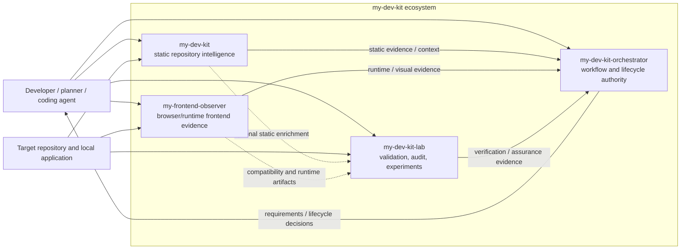
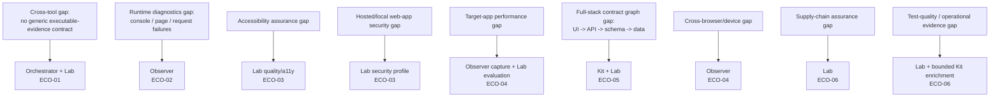
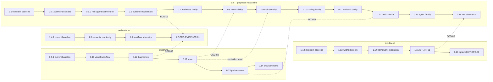
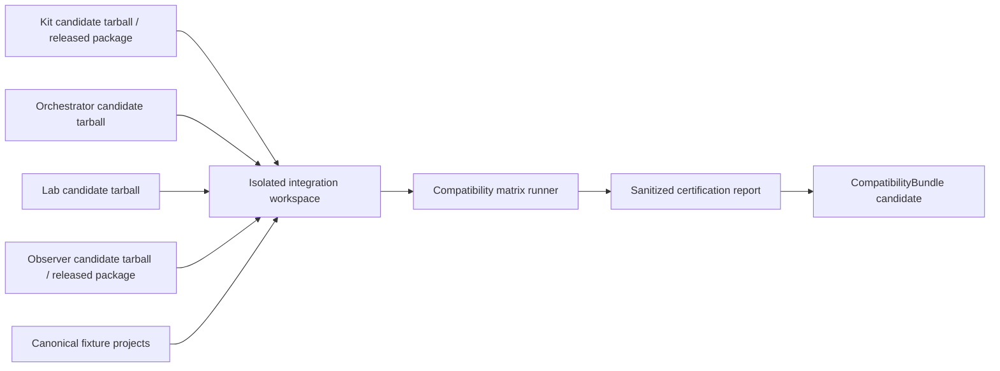

# Coordinated my-dev-kit ecosystem development roadmap

Date: 2026-09-21
Status: PROPOSED COORDINATED PLAN — saving this file does not by itself reassign repository-local roadmap versions, implement contracts, or certify package compatibility.
Authority: cross-repository sequencing, contract governance, dependency logic, and proposed version mapping; each repository retains authority over its own normative version scope until explicitly reconciled.
Scope: four independently versioned programs; shared contract governance; bounded software/web assurance additions.

## 1. Decision

Keep the four programs independent. Coordinate development by stable ecosystem milestone IDs, explicit producer/consumer contracts, and immutable tested bundle manifests. Package versions are release identifiers, not evidence of compatibility. There is no fifth application, mandatory shared npm package, automatic cross-tool executor, or requirement that every normal edit run all four programs.

Separate four things:
- Package version: identifies a shipped implementation.
- Artifact contract version: identifies accepted input/output shape and semantics.
- Capability/policy/metric version: identifies what a check actually measures or requires.
- Certified bundle identity: identifies exact package artifacts, environments, fixtures, and compatibility results tested together.

Use contract dependencies for architecture, package dependencies only for genuine runtime imports, and development/test dependencies for certification. A Lab test consuming an Orchestrator report is not an Orchestrator runtime dependency on Lab.

## 2. Inspected baseline and existing commitments

Read-only source snapshots inspected:
- my-dev-kit: main, 3707ab1eecef289eb6c91ffc1f45d4215e7232d3; package metadata 1.12.3.
- my-dev-kit-orchestrator: main, 46e923e9ce643c8a47cd30933ea653ac6ed9edb3; current-state documentation 1.4.1.
- my-dev-kit-lab: main, 449ed7e884bfdc4591bca04ea5d9efa12d0f6686; package/current roadmap 0.5.0.
- my-frontend-observer: master, 7dc3c0879b4677884547904d200c85eb77bcdc18; current-state documentation 0.9.1.

These snapshots are inspection provenance, not a newly executed four-way certification. Registry, tag, release, and package identity must be reconciled again at actual release start. Some Lab current-state and command prose retains release-preparation/unreleased wording while the roadmap identifies 0.5.0 as current. Do not let those historical sentences control release actions. The central workflow guide's review baseline also retains an older Observer version; preserve that as a dated review rather than interpreting it as the latest compatible package.

Existing commitments to preserve:
- Kit 1.13.0: Android retrieval benchmarks, examples, workflows.
- Kit 1.14.0: broader Python/JavaScript/framework evidence. Kit 2.0.0 remains a separate artifact/plugin initiative, not a prerequisite for this work.
- Orchestrator 1.5.0: semantic continuity/evidence-to-implementation bridge.
- Orchestrator 1.6.0: workflow economics and run telemetry, not target-application observability.
- Observer 0.10.0: full visual human–LLM workflow using its existing canonical acceptance surface.
- Lab 0.5.1 and 0.5.2: warm-index benchmark expansion and real-agent campaign work.
- Lab's existing freshness, scaling, retrieval, agent-success, provider-telemetry, and report/gallery scopes must survive any re-sequencing.


### 2.1 Current ecosystem architecture

The four programs already form a layered evidence and workflow system. The coordinated roadmap extends this architecture rather than creating a fifth application or collapsing ownership into one monolith.



The durable responsibility split is:

- **Kit answers:** what source exists, where is ownership, and what static relationships are supported by evidence?
- **Observer answers:** what did the selected local frontend render and what supported runtime/frontend contract result was observed?
- **Lab answers:** what did an authorized validator, audit, experiment, or imported verification report establish for a defined target and policy?
- **Orchestrator answers:** given the selected workflow requirements and accepted evidence, may the workflow proceed or complete?

No arrow in the diagram means automatic runtime invocation unless a future milestone explicitly adds it. Most integration should remain artifact- and contract-based.

### 2.2 Current gap map and destination ownership

The gaps identified by the ecosystem review are not all the same type. Some are evidence-production gaps; others are cross-tool integration gaps.



The sequencing rule is therefore not "finish one program, then move to the next." It is "freeze the smallest shared contract needed by the next capability, let producers and consumers implement independently against that contract, then certify exact combinations."

### 2.3 Coordination problem this roadmap solves

Without a coordinated plan, four failure modes are likely:

1. **Version deadlock:** a downstream release waits for an upstream package to publish even though candidate tarballs could have been tested earlier.
2. **Contract drift:** two repositories independently implement fields named similarly but with different semantics, forcing corrective patches after publication.
3. **False compatibility:** package versions appear compatible because parsing succeeds even though they refer to different target revisions, runtime states, or policy definitions.
4. **Roadmap collision:** a new ecosystem feature silently occupies a version number already assigned to a different unimplemented milestone.

This roadmap prevents those failures by separating specification, implementation, publication, certification, and activation.

## 3. Corrections to the earlier recommendations

Orchestrator already has verification-command evidence and a canonical RunIntegrityGate/judge/final-report eligibility architecture. Extend those; do not create a second acceptance engine.

Lab already has process, browser, report, audit, and security infrastructure. New capture and assurance work should reuse those owners. Do not create one runner for every domain or make tutorial video production a prerequisite for testing.

Observer already owns frontend contracts, reference fidelity, bounded runtime evidence, and explicit static/runtime correlation. Preserve those verdicts and identities. Broader evidence must not silently change the meaning of an existing Observer PASS.

The common evidence model should be a small envelope or sidecar around native artifacts, not a universal replacement for every domain schema. Different tools' exit codes and result enums remain distinct.

Accessibility validation need not wait for Observer to become an accessibility scanner. Lab may run a dedicated live-browser adapter in its own controlled session. Browser session ownership must be explicit; separate tools do not magically share authenticated state.

Do not build new package dependencies merely because two tools exchange files. Start with schema documents, contract hashes, fixtures, and generated/vendored validation assets. Consider extraction only after demonstrated maintenance need.

## 4. Ownership and dependency direction

Planner/human:
- Chooses scope, requirements, risk profile, accepted policies, milestones, and separate edit/push/merge/publication permissions.
- Freezes cross-repository contracts before implementation.
- Authorizes baseline promotion and breaking-policy changes.

my-dev-kit:
- Owns static indexing, graph facts, bounded retrieval, source provenance, and supported framework/API/data relationships.
- Does not execute project tests, browsers, migrations, scanners, or deployment.
- Hosts central ecosystem documentation without becoming a runtime coordinator.

my-dev-kit-orchestrator:
- Owns workflow requirements, staged readiness, lifecycle, accepted evidence references, correction routing, and final-report eligibility.
- Extends existing integrity/judge owners; does not recalculate Observer geometry or Lab security findings.
- Keeps repository-context readiness separate from execution/assurance readiness. A failed test or missing execution record is not automatically NEED_CONTEXT. Add a separately typed evidence dimension and integrate it into the existing final-eligibility path without redefining legacy context verdicts.
- Does not run the coding agent or project commands.

my-dev-kit-lab:
- Owns authorized verification capture/import adapters, scoped assurance evaluators, experiments, compatibility fixtures, and coordinated validation reports.
- Reuses existing command/process/browser/report/security owners.
- Can independently report a scoped assurance result, but does not duplicate Orchestrator workflow eligibility.

my-frontend-observer:
- Owns browser observations, screenshots, visual/reference contracts, browser diagnostics, supported performance capture, and eventually controlled state/browser-matrix evidence.
- Never edits target source or silently broadens loopback/credential boundaries.

Target project and CI:
- Own actual tests, application setup, migrations, fixtures, credentials, build configuration, instrumentation, and deployment.
- May produce compatible evidence without running a full Orchestrator workflow.

Data flow:

    target source ----------> Kit --------> native static artifacts ----+
    controlled local app ---> Observer ---> native runtime artifacts ---+--> evidence references
    project tests/CI --------> Lab adapters / native reports ------------+          |
    target/source ----------> Lab assurance ----------------------------+          v
                                                                       Orchestrator integrity
                                                                              |
                                                                       eligibility/correction

Lab's cross-repository regression suite tests this flow as a development dependency. It does not become an unavoidable runtime component of every edit.

## 5. Contract ownership and staged freeze

ECO-00 freezes the minimum identity/envelope/compatibility interfaces and the requirement-to-evidence reference needed by ECO-01. Runtime-state and metric-domain contracts below are reserved interface responsibilities; their complete schemas, limits, and fixtures are frozen immediately before their own milestones. Do not hold the first working integration hostage to a speculative universal schema.


### 5.0 Contract-governance principles

Before defining individual schemas, apply these rules to every cross-repository interface:

- One repository owns each canonical schema or semantic policy. Consumers may vendor/generated-copy it for validation, but they do not fork its meaning.
- A schema version describes serialized structure and semantics. A package version describes implementation. They are never treated as the same namespace.
- A capability identifier describes behavior that may span several schema revisions without forcing consumers to infer capability from package version.
- A policy version describes decision thresholds/rules. Re-evaluating identical raw evidence under a changed policy produces a new evaluation result, not a mutation of the old result.
- Native producer artifacts remain authoritative within their own domain. Shared envelopes reference them rather than flattening them into an impoverished universal result.
- Cross-tool artifacts are immutable once used for certification. Corrections generate a superseding artifact with a new identity.
- Every mandatory consumer decision is fail-closed for unknown required schema majors, missing required capability, digest mismatch, wrong subject, or incomplete required evidence.
- Optional unknown evidence is not a failure by itself, but the consumer must state that it was not evaluated.

### 5.1 Contract lifecycle

Every ecosystem contract follows this state model:

```text
DRAFT
  -> FROZEN_FOR_MILESTONE
  -> IMPLEMENTED_BY_PRODUCER
  -> IMPLEMENTED_BY_CONSUMER
  -> INTEGRATION_TESTED
  -> CERTIFIED_FOR_PROFILE
  -> DEPRECATED
  -> RETIRED
```

Rules:

- `DRAFT` may change freely and cannot be used as a release gate.
- `FROZEN_FOR_MILESTONE` means field names, semantics, error handling, and required fixtures are fixed for the milestone. A material change requires a contract-revision decision and invalidates implementation assumptions that depended on the prior draft.
- `IMPLEMENTED_BY_*` means repository-local tests pass; it does not imply interoperability.
- `INTEGRATION_TESTED` requires a real producer artifact consumed by the actual consumer candidate, not only handwritten fixtures.
- `CERTIFIED_FOR_PROFILE` applies to a defined compatibility bundle and assurance profile, never universally.
- `DEPRECATED` remains readable/writable only according to the documented compatibility plan.
- `RETIRED` is allowed only after supported consumers have a migration path and no active certified bundle requires the old contract.

Avoid arbitrary time-based deprecation windows. Retirement is capability- and consumer-readiness-based. At minimum, the replacement contract must have a certified bundle and every currently supported consumer must either read it or explicitly declare the old profile unsupported before old-reader support is removed.

### 5.2 Contract-change decision record

Every cross-tool contract change records:

```text
CONTRACT_ID
CURRENT_REVISION
PROPOSED_REVISION
OWNER_REPOSITORY
AFFECTED_PRODUCERS
AFFECTED_CONSUMERS
CHANGE_CLASS: PATCH | ADDITIVE | BREAKING | POLICY_ONLY
RATIONALE
OLD_BEHAVIOR
NEW_BEHAVIOR
MIGRATION_OR_DUAL_READ_PLAN
FIXTURE_CHANGES
CERTIFICATION_MATRIX_CHANGES
DEFAULT_ACTIVATION_CHANGE
ROLLBACK_PATH
```

A package release note is not a substitute for this decision record.

### 5.3 EnvironmentIdentityV1

`SubjectIdentityV1` identifies the source candidate; `EnvironmentIdentityV1` identifies the execution context that can materially change evidence.

Minimum fields/concepts:

- operating system and architecture;
- runtime/toolchain identity where relevant (for example Node and browser engine/build);
- dependency-install identity or lockfile digest;
- non-secret configuration/profile identity;
- database/fixture dataset identity when runtime behavior depends on it;
- timezone/locale/device profile only when relevant to the selected evidence;
- instrumentation mode and test mode when they alter behavior;
- explicit unavailable/unknown fields rather than invented defaults.

Environment identity should be bounded. Do not serialize an entire process environment or leak secrets merely to improve reproducibility.

### 5.4 NativeArtifactReferenceV1

A cross-tool artifact points to a native producer artifact using a bounded reference:

- producer-owned artifact kind and schema version;
- relative path or stable handle under the declared evidence root;
- SHA-256 digest of the referenced bytes;
- optional bounded logical ID returned by the producer;
- byte size and media type where useful;
- provenance showing whether the reference was captured directly or imported;
- path-containment validation and no arbitrary path dereference by an untrusted consumer.

Consumers validate the digest before trusting cached/imported content. A file with the right name but the wrong bytes is incompatible evidence.

### 5.5 EvidenceRequirementV1

Keep requirements separate from evidence instances. A requirement contains:

- stable requirement ID and owning workflow/profile;
- semantic category (`test`, `build`, `lint`, `visual`, `security`, `accessibility`, `performance`, `api-contract`, `supply-chain`, or future registered category);
- required/optional status;
- target scope and responsibility reference;
- accepted artifact kinds/capabilities;
- minimum producer contract support, not an inferred package version;
- freshness rule and subject/environment matching rule;
- accepted native verdicts and explicit incomparable/unavailable treatment;
- policy reference when a domain evaluator is required;
- correction owner when the requirement is unsatisfied.

This prevents a generic PASS-shaped record from satisfying an unrelated requirement.


### 5.6 EvidenceRequirementEvaluationV1 and RunAssuranceSummaryV1

Orchestrator needs a generic consumer-side decision model that does not confuse assurance failures with missing static context.

Recommended requirement-evaluation states:

- `satisfied`: compatible current evidence meets the requirement and its selected policy;
- `failed`: compatible current evidence ran/evaluated and the native/policy result failed;
- `missing`: required evidence was never supplied or produced;
- `unavailable`: the required check could not execute because a prerequisite/tool/runtime was unavailable;
- `stale`: evidence exists but does not match the required subject/freshness contract;
- `incompatible`: evidence exists but the consumer cannot safely interpret its required schema/capability;
- `incomplete`: evidence is compatible but truncated/partial in a way that loses required information;
- `not-applicable`: the selected requirement explicitly does not apply to this target/profile;
- `unevaluated-optional`: optional evidence was omitted or unsupported without blocking the profile.

`RunAssuranceSummaryV1` aggregates requirement evaluations without hiding them behind a score. It records blocking requirement IDs, correction owner/category, evidence references, and overall eligibility for the selected assurance profile.

Mapping rule:

```text
repository-context deficiency -> existing context-readiness / NEED_CONTEXT path
failed executed test/security/accessibility/etc. -> assurance failure/correction path
missing/unavailable mandatory execution evidence -> assurance incomplete/blocking path
stale/incompatible mandatory evidence -> assurance refresh/compatibility blocking path
optional unevaluated evidence -> visible but non-blocking
```

The exact judge/correction enum integration belongs to the Orchestrator version-start design. Do not force all these conditions into the legacy `NEED_CONTEXT` verdict merely to reuse an existing string.

### 5.7 SubjectIdentityV1
- Stable target identifier, source commit when available, and a scoped source-snapshot/input-manifest digest.
- Dirty tracked files and relevant untracked source files must be represented. A commit SHA alone is insufficient.
- Lockfile/dependency inputs, non-secret configuration, and source selection/exclusions are declared.
- Runtime build identity is recorded separately. A loopback URL does not prove which source produced the running application.
- Provenance distinguishes caller-declared identity from identity corroborated by a trusted capture/build process.

### 5.8 EvidenceEnvelopeV1
- Namespaced kind and independent schema version.
- Producer package/version and invocation/run identity.
- Subject reference and environment reference.
- Native payload kind/schema, bounded relative reference, and byte digest.
- Availability, completeness, truncation, limitations, and provenance strength.
- Native result/exit code remain available; neither is blindly converted to a common PASS.
- No credentials, raw environment dumps, request bodies, or unbounded logs embedded in the envelope.

### 5.9 VerificationPlanV1 and VerificationRecordV1
- Stable requirement IDs, required/optional status, scope, accepted evidence kinds, and versioned policy references.
- The plan is frozen before final verification; modifying it changes its digest and requires re-evaluation.
- Records distinguish direct capture, CI-attested import, and caller-authored/imported assertions.
- Command identity, resolved executable, argv, cwd, tool version, execution status, exit code, duration, and bounded stdout/stderr references.
- Parsed test totals only when a supported reporter adapter actually supplies them. Unknown counts are unavailable, not zero.
- A nonzero exit code, timeout, malformed report, or unsupported required adapter cannot become PASS because output contains the word 'passed'.
- Evidence for a test is not interchangeable with evidence for build, lint, visual acceptance, security, or documentation.

### 5.10 ConsumerSupportV1
- Accepted artifact kinds/schema versions and required capabilities.
- Explicit handling of legacy, unknown, unavailable, partial, and incompatible inputs.
- Supported versus tested package combinations are distinct.
- Unknown mandatory capability/schema fails closed. Optional unsupported evidence is explicitly not evaluated.

### 5.11 RuntimeTargetContractV1
- Local target identity, allowed origins, browser/session settings, route, viewport, theme, fixture/data identity, and desired/achieved state evidence.
- Declared authenticated state is not proof of login.
- Project-owned setup establishes state; no implicit shared browser session across Lab and Observer.
- Authorized command execution is opt-in. Records and reports never become executable instructions.
- Credentials are ephemeral, redacted, excluded from durable artifacts, and used only in an explicitly authorized isolated environment.
- No production reset, automatic remote crawling, blanket network permission, or arbitrary evaluation escape hatch.

### 5.12 MetricPolicyV1
- Metric ID/definition version, units, collection method, applicability, sample counts, aggregation, uncertainty, and missing-value semantics.
- Threshold/policy ID/version separate from metric definition.
- Repeated runs required for noisy performance comparisons; no claim of field conformance from a single local browser run.
- Automated accessibility evidence never claims full accessibility conformance.
- Security control references include the standard version and bounded tested coverage.

### 5.13 CompatibilityBundleV1
- Milestone/profile ID, specification digest, exact tool package artifacts/versions/source commits/hashes, contract capabilities, and fixture revision.
- Environment matrix and test-result references.
- Status: proposed, candidate, certified, rejected, or superseded.
- Certification scope is explicit. A bundle certified for visual change review is not automatically certified for authenticated security testing.

Common schema ownership: canonical interface-only assets under my-dev-kit/contracts/ecosystem/. Native domain schemas stay in their producing repositories. Consumer copies are pinned/generated with hash checks, not separately edited definitions. No runtime downloads of schemas or implicit package installation.

## 6. Compatibility rules

- Package SemVer and artifact schema versions are independent.
- For major-1 packages, backward-compatible feature additions get minor releases; corrections get patch releases; incompatible public behavior requires an appropriate major or explicitly compatible opt-in path.
- Although pre-1.0 packages have weaker SemVer stability guarantees, use conservative compatibility discipline and exact certification pins.
- 'Additive' is not automatically compatible: closed-object validators reject unknown fields, and new enum values may break consumers. Prefer separate optional sidecars when native readers are closed.
- Readers must identify unsupported required schema/capability rather than silently dropping fields.
- Preserve old native artifacts. Never rewrite approved baselines, historical evidence, or published package bytes in place.
- For a breaking schema transition, introduce dual readers first, then an opt-in new producer format, then certify and activate the new path. Keep the old writer/default until its supported consumers can migrate.
- No downgrade that discards required witness evidence. Legacy evidence remains usable for its original supported workflow, not retroactively upgraded into stronger assurance.
- Normal development may resolve current supported upstreams at task start, but then fixes them for that run. Release and regression validation use exact artifacts, never moving latest tags.


### 6.1 Dependency classes

Every cross-repository relationship must be labeled as one of these classes:

| Dependency class | Meaning | Example |
| --- | --- | --- |
| Runtime package dependency | One package imports/executes another as part of supported normal behavior | Use only when genuinely necessary |
| Contract dependency | A consumer understands an artifact/capability owned elsewhere | Orchestrator consuming bounded Observer evidence |
| Development/test dependency | A repository's CI uses another candidate to verify compatibility | Lab ecosystem fixtures |
| Documentation dependency | A repo links to the canonical cross-repo guide | sibling docs links |
| Optional enrichment dependency | Evidence improves a result but is not needed for core execution | Kit static graph enriching Lab API analysis |

Do not convert a contract dependency into an npm dependency merely for convenience.

### 6.2 Compatibility vocabulary

Use these terms consistently:

- **Supported:** the consumer declares the contract/capability acceptable in principle.
- **Tested:** a particular producer/consumer combination executed at least the defined compatibility test.
- **Certified:** the exact bundle passed the complete profile-specific certification gate.
- **Active:** the profile is allowed to govern workflow completion by default for that selected configuration.
- **Legacy-readable:** the consumer can interpret an older artifact sufficiently for its original workflow, but it may not satisfy newer requirements.
- **Incompatible:** the consumer cannot safely use the artifact for the requested requirement.
- **Unevaluated:** optional evidence exists but no compatible evaluator was selected.

Never use `supported` and `certified` interchangeably.

### 6.3 Capability negotiation

Consumers decide compatibility using explicit artifact metadata and a local support registry. They do not probe package versions and guess.

Conceptually:

```text
artifact.kind
artifact.schemaVersion
artifact.capabilities[]
artifact.producer
requirement.acceptedKinds[]
requirement.requiredCapabilities[]
consumer.supportedSchemas[]
consumer.supportedCapabilities[]
```

The evaluation result records *why* a boundary was accepted or rejected. Unknown capability names cannot satisfy mandatory requirements.

### 6.4 Compatibility matrix policy

For each new contract revision, test at least:

1. previously supported producer -> new consumer;
2. new producer -> new consumer;
3. new producer -> previously supported consumer when backward compatibility is claimed;
4. minimum supported producer -> new consumer when a minimum remains advertised;
5. malformed/unknown-major producer -> consumer failure path;
6. optional unsupported extension -> explicit unevaluated path;
7. exact installed-package candidates -> integration fixture.

Do not build an unbounded Cartesian matrix over every historical version. The bundle registry records what was actually tested.

### 6.5 Breaking-change sequencing

If a producer would emit something an old supported reader cannot accept:

```text
consumer dual-reader release
    -> certify old producer + new reader
    -> producer opt-in writer release
    -> certify new producer + new reader
    -> activate new writer/default only after migration evidence
    -> deprecate old writer/read path
```

If a producer change is truly backward-compatible under the existing reader contract, producer-first publication is permitted, but the new ecosystem capability remains uncertified until integration testing completes.

## 7. Proposed package-version reservations

These are proposed scheduling targets, not existing releases. Recheck tag/package availability and active branches before committing reservations. Published history never changes. New milestones are referenced by stable IDs even when a future version target moves.

### 7.1 Kit
- 1.13.0: existing Android proof/example scope unchanged.
- 1.14.0: existing framework expansion, with explicit facts needed by future full-stack contracts; preserve all existing planned framework work.
- 1.15.0 / KIT-API-01: supported UI/client/API/schema/data relationships and contract-oriented change evidence, building on 1.14.0. No complete static proof of authorization or migrations.
- 1.16.0 / KIT-OPS-01: bounded configuration/instrumentation/deployment-source facts where real consumer needs justify them; not required for the initial rollout.
- 2.0.0: retained separate larger schema/plugin program; not a prerequisite.

### 7.2 Orchestrator
- 1.5.0: existing semantic continuity scope unchanged; define stable responsibility IDs usable by later evidence.
- 1.6.0: existing workflow telemetry scope unchanged; link run/invocation identities without claiming application observability.
- 1.7.0 / ORC-EVIDENCE-01: typed evidence-plan/reference intake; adapters for existing native artifacts; cross-tool freshness/compatibility enforcement through canonical integrity/judge owners; structured status/check output; preservation across prompt/mark/check/status/export/correction paths.
- Further Orchestrator releases are not automatically required for each new Lab check. Versioned generic requirement/evidence interfaces should allow new externally evaluated profiles without duplicating their policy. A genuinely new mandatory lifecycle semantic requires a separately scoped minor.

### 7.3 Observer
- 0.10.0: existing full visual workflow scope unchanged. It must not wait for the entire new assurance program.
- 0.11.0 / OBS-DIAG-01: bounded/redacted console, page-error, request-failure and HTTP-response evidence; distinguish network transport failure from an expected HTTP error; explicit observation windows and optional diagnostic contracts.
- 0.12.0 / OBS-STATE-01: governed project-supplied test-state/session setup contract with achieved-state evidence. Reuse ownership boundaries; do not turn Observer into a general journey runner or authentication platform.
- 0.13.0 / OBS-PERF-01: versioned local performance capture, browser/environment provenance, comparable baseline/candidate samples, unavailable metrics explicit.
- 0.14.0 / OBS-BROWSER-01: bounded browser/viewport matrix; preserve each browser's identity and capabilities. Unsupported browser metrics remain unavailable. Do not compare baselines across incompatible engines as though identical.

### 7.4 Lab — deliberate proposal to rebaseline only unimplemented future slots

The old roadmap already reserves 0.6–0.9. The new features cannot silently take those numbers. Recommended new schedule:

- 0.5.1: existing warm-index benchmark expansion, unchanged.
- 0.5.2: existing real-agent warm-index campaigns, unchanged.
- 0.6.0 / LAB-EVIDENCE-01: authorized verification capture/import, evidence identity and integrity, pure adapter contracts, controlled target boundary, and isolated ecosystem certification harness. Reuse existing process/browser/report infrastructure. Not an unrestricted task runner.
- 0.7.0–0.7.3 / LAB-FRESHNESS: former 0.6.0–0.6.3 scope, preserved; candidate/index freshness, neighborhoods, staleness experiments, partial-refresh planning.
- 0.8.0 / LAB-A11Y-01: quality-audit substrate and bounded live accessibility adapters, manual-review requirements, explicit target-state provenance. Reuse existing planned quality audit type rather than a parallel audit engine.
- 0.9.0 / LAB-WEBSEC-01: bounded local web-app security profile through the existing security-validation owner; safe target setup and authorization tests, versioned control coverage; no remote or manual pentesting by default.
- 0.10.0–0.10.2 / LAB-SCALING: former 0.7.0–0.7.2 context-window, synthetic-scale, and real/local repository work, preserved.
- 0.11.0–0.11.2 / LAB-RETRIEVAL: former 0.8.0–0.8.2 precision/recall, query strategy, and context-pack evaluation, preserved.
- 0.12.0 / LAB-PERF-01: performance budget/regression adapters, statistical comparison and applicability rules; consume compatible Observer performance evidence where selected, or other explicitly supported collectors.
- 0.13.0–0.13.2 / LAB-AGENT: former 0.9.0–0.9.2 agent success, provider telemetry/scheduler, and report/gallery work, preserved.
- 0.14.0 / LAB-API-01: API/schema compatibility evidence and project-owned database/migration verification. Kit association evidence is optional enrichment; executing a migration test does not require a full static graph.
- 0.15.0 / LAB-SUPPLY-01: SBOM/license-policy/provenance adapters; distinguish manifest presence, signature verification, and artifact-to-source correspondence. No automatic publication or legal-conformance claim.
- 0.16.0 / LAB-TEST-01: test-quality adapters and non-heuristic raw evidence for coverage, mutation and repeated-run flakiness where supported. No universal composite quality score.
- 0.17.0 / LAB-OPS-01: bounded observability/configuration/IaC evidence adapters if demanded by actual target projects. Integrate existing telemetry/scanning tools; do not build a hosted monitoring or deployment platform.
- 1.0.0 and the existing 1.1.0–1.4.0 post-stable milestones retain their purposes. Revisit graduation criteria explicitly; do not imply that every aspirational optional adapter is mandatory for stable release.

This mapping is a proposed prioritization change. Before adoption, retain each old heading or redirect, stable work ID, old target, new target, rationale, and all acceptance criteria. If any supposedly unimplemented scope is active by adoption time, finish that bounded active work or record an explicit reschedule; do not overwrite its branch or history.

The chronological order within a package is a delivery constraint, not a claim that accessibility technically depends on freshness research, or that performance technically depends on retrieval experiments.


### 7.5 Proposed dependency matrix by milestone

This table describes *capability prerequisites*, not permanent package pins.

| Milestone | Producer capability required | Consumer capability required | Packages expected to change | Packages not required to change |
| --- | --- | --- | --- | --- |
| ECO-00 | none; documentation/fixtures only | none | none necessarily | all runtime packages |
| ECO-01 | Lab verification/evidence capture; adapters for current native artifacts | Orchestrator generic evidence intake | Lab, Orchestrator | Kit, Observer unless missing provenance is demonstrated |
| ECO-02 | Observer diagnostics/state evidence | generic evidence intake already shipped | Observer | Kit; Lab optional for certification only; Orchestrator unless lifecycle semantics change |
| ECO-03 | Lab accessibility/security evaluators | generic evidence intake | Lab | Kit/Observer not mandatory for first profile |
| ECO-04 | Observer performance/browser evidence | Lab metric/policy evaluation + generic Orchestrator intake | Observer, Lab | Kit |
| ECO-05 | Kit supported API/data relationship evidence; project-native execution evidence | Lab API/migration evaluation + generic Orchestrator intake | Kit, Lab | Observer unless UI runtime verification selected |
| ECO-06 | domain-specific native/adapted evidence | generic evidence intake | mostly Lab; bounded Kit additions where justified | Observer for non-browser profiles |

### 7.6 Version-number collision rules

Before reserving any proposed version:

1. inspect current package metadata, tags/releases, active branches, and current roadmap;
2. preserve any already assigned unreleased scope;
3. if a version is occupied by active work, choose the next free version rather than silently redefining it;
4. stable milestone IDs (`ECO-*`, `KIT-*`, `ORC-*`, `LAB-*`, `OBS-*`) survive version movement;
5. update the central mapping only after the user explicitly approves a rebaseline that changes an existing repo-local roadmap assignment.

The Lab mapping in this document is therefore a **proposed rebaseline**. Saving this central roadmap does not itself move those local version headings.


### 7.7 Proposed release train view

The release train preserves each repository's already assigned work and shows where the new coordinated capabilities would enter if the proposal is adopted.



The dashed edges are capability relationships, not npm dependencies. If actual repository progress reaches these proposed version numbers differently, keep the milestone IDs and move the proposed target versions rather than rewriting history.

### 7.8 Proposed certification bundle sequence

Use stable bundle/profile IDs independent of package version:

- `ECO01-SOFTWARE-CORE-V1`: first generic executable-evidence certification.
- `ECO02-FRONTEND-DIAGNOSTICS-V1`: core + Observer diagnostics/state evidence.
- `ECO03-WEB-ASSURANCE-V1`: selected accessibility/security assurance.
- `ECO04-PERFORMANCE-V1`: local comparable performance evidence and policy.
- `ECO05-FULLSTACK-CONTRACT-V1`: static impact + API/schema/migration/client verification.
- `ECO06-<DOMAIN>-V1`: separate bundles per later assurance domain rather than one oversized omnibus bundle.

A bundle is created as `proposed` at milestone start, becomes `candidate` when exact package artifacts and fixtures are locked, and becomes `certified` only after the profile matrix passes.

## 8. Cross-repository milestone dependency graph

ECO-00 — contract and roadmap freeze
  -> ECO-01 — common executable evidence + lifecycle integration
       -> ECO-02 — browser diagnostics and controlled state
       -> ECO-03 — scoped accessibility and web security
       -> ECO-04 — performance contracts and browser matrices
       -> ECO-06 — supply-chain, test quality, operational evidence

Kit 1.13 -> Kit 1.14 -> KIT-API-01
                         + ECO-01 -> ECO-05 — full-stack contract assurance

These arrows indicate actual prerequisite capabilities. Unrelated research, visual workflow completion, and native tool maintenance can continue independently.

### 8.1 ECO-00: contract/planning freeze
- Deliver central plan, contract registry, minimal schema/fixture set, command-surface inventory, compatibility lock format, and preserved roadmap mapping.
- No production code or package bump is required merely to write interface documents.
- Define positive and negative fixtures before producer/consumer implementation.
- Exit: each contract has one owner, each consumer has explicit requirements, versions have no collisions, and all hard dependencies form an acyclic graph.

### 8.2 ECO-01: first end-to-end evidence milestone
- Producer work: LAB-EVIDENCE-01 / Lab 0.6.0, plus bounded adapters over existing Kit/Observer artifacts.
- Consumer work: ORC-EVIDENCE-01 / Orchestrator 1.7.0, following its existing 1.5/1.6 delivery commitments.
- Kit and Observer production changes are not required unless adapter tests demonstrate genuinely missing provenance that cannot be honestly represented as unknown.
- First proposed proof tuple: Kit 1.12.3 + Observer 0.9.1 + Lab 0.6.0 candidate + Orchestrator 1.7.0 candidate. This is a test target, NOT certified compatibility. If other upstreams have advanced, test that tuple separately rather than silently changing the lock.
- Fixture: one small local full-stack app plus a small CLI project, frozen source and deterministic data. Use the CLI to prove that no browser is required for ordinary software verification.
- Exit: final eligibility passes only with current required native evidence. A deliberately failed project test prevents completion even when visual evidence passes. No core retrieval-engine rewrite.

### 8.3 ECO-02: runtime diagnostics/state
- OBS-DIAG-01 depends on the frozen envelope/diagnostic contract and safe capture policy, not on the entire Lab roadmap.
- OBS-STATE-01 depends on a separately reviewed ephemeral test-state contract. Independent sessions must reproduce and verify their state.
- Existing native visual verdicts remain backward-compatible. Diagnostic enforcement is explicit, scoped, and opt-in until selected by a new assurance plan.
- Contract readers must be ready before a new mandatory payload is advertised; use compatibility fixtures, not guessed version ranges.
- Exit: unexpected page/request failures are captured and handled; expected negative HTTP responses are not blanket failures; secrets are redacted; missing observation windows/state evidence prevent stronger claims.

### 8.4 ECO-03: accessibility/security
- LAB-A11Y-01 depends on evidence and safe controlled targets; it does not require Observer performance or cross-browser support.
- LAB-WEBSEC-01 depends on evidence, safe local application state, explicit authorization, and declared security policies; not on Kit API graph completeness.
- Browser-backed checks run in a dedicated assurance context without tutorial overlays, video timing effects, or reuse of a dirty prior session.
- Exit: seeded accessibility/security violations are detected; missing mandatory tools or unproven auth state cannot become a pass; untested controls and manual checks remain explicit.

### 8.5 ECO-04: performance/browser support
- Observer capture contract freezes before either the producer or Lab evaluator is implemented.
- LAB-PERF-01 consumes only explicitly compatible evidence and metric definitions. Pure budget evaluation belongs in one canonical owner; Observer's existing geometry/reference evaluators remain independent.
- Cross-browser support is an extension axis, not a universal prerequisite. Single-browser performance may ship first.
- Exit: repeated comparable samples distinguish a genuine regression from unsupported/incomparable/noisy measurement. A different engine, data state, instrumentation mode, or metric definition cannot silently share a baseline.

### 8.6 ECO-05: full-stack contract graph
- Kit 1.14 supplies framework facts; Kit 1.15 adds supported associations and change evidence.
- LAB-API-01 uses explicit API/schema contracts and real project tests. Static graph enrichment is optional for execution, required only when the workflow promises source-impact mapping.
- Orchestrator consumes requirement/evidence references through its common interface rather than becoming an API scanner.
- Exit: a representative field change is traced across supported source layers and its API/database/client tests run against the same candidate. Unsupported dynamic edges remain unresolved.

### 8.7 ECO-06: broader software assurance
- Supply chain and test quality depend on common evidence and native tool adapters, not on all browser work.
- Operational evidence uses actual instrumentation/configuration artifacts; static presence is not proof of correct runtime behavior.
- These remain profile-selected. A Python CLI does not require browser performance checks; a no-database project does not need migration evidence.


### 8.8 Detailed implementation batches

The following batch structure is the recommended starting plan when each milestone begins. The version-start planner must still inspect the then-current source and may split batches further, but it should not collapse the contract and integration gates.

#### ECO-00 batches — contract and roadmap freeze

**Batch ECO-00.1 — inventory and reconciliation**
- Re-resolve all four current branches, package versions, tags/releases, roadmaps, open/active version branches, and documented schemas.
- Record conflicting/stale documentation without changing publication status from inference.
- Build the protected-content/version-assignment inventory required by each repository's documentation policy.

**Batch ECO-00.2 — contract registry foundation**
- Define contract IDs, ownership, schema locations, capability IDs, policy IDs, and change-class rules.
- Define `SubjectIdentityV1`, `EnvironmentIdentityV1`, `NativeArtifactReferenceV1`, `EvidenceEnvelopeV1`, `EvidenceRequirementV1`, and the minimum compatibility-bundle structure.
- Create positive and negative JSON fixtures before implementation.

**Batch ECO-00.3 — compatibility and certification specification**
- Define supported/tested/certified/active states.
- Define candidate-tarball isolation, bundle identity, certification matrix, and supersession rules.
- Define how current Kit, Observer, Lab, and Orchestrator native artifacts are referenced without changing their schemas.

**Batch ECO-00.4 — roadmap extraction plan**
- Produce an explicit per-repo proposed change ledger.
- For every proposed moved Lab milestone, preserve old version, proposed new version, acceptance criteria, and rationale.
- Do not edit local roadmap assignments until that rebaseline receives explicit approval.

**ECO-00 gate:** documentation, contract fixtures, and dependency graph are internally consistent; no circular mandatory dependency exists; no existing roadmap scope disappears.

#### ECO-01 batches — executable verification evidence

**Lab Batch 1 — verification model and safe adapter boundary**
- Add pure types/validation for verification plans/records and imported evidence.
- Reuse existing workspace/path/process safety utilities.
- Freeze allowed execution/import modes and reject arbitrary executable instructions embedded in evidence.

**Lab Batch 2 — first native adapters**
- Support a deliberately small set of project verification evidence (for example generic exit-code capture plus structured adapters for selected test/report formats).
- Preserve raw native status and reporter provenance.
- Make unknown test counts unavailable rather than parsing prose heuristically.

**Lab Batch 3 — subject/environment integrity**
- Bind records to source snapshot and execution environment.
- Detect stale/mismatched candidate evidence.
- Add import integrity/digest checks and bounded log references.

**Orchestrator Batch 1 — requirement/evidence persistence**
- Introduce generic evidence requirements and references without changing current context-readiness semantics.
- Ensure run/export persistence preserves the new structured records.

**Orchestrator Batch 2 — canonical eligibility integration**
- Extend the existing integrity/final-eligibility path with an execution/assurance readiness dimension.
- Ensure `prompt`, `mark`, `status`, `check`, judge/correction, and export agree.
- Preserve legacy runs that have no new evidence requirements.

**Orchestrator Batch 3 — machine-readable inspection**
- Add structured status/check projection where needed by integration tests rather than scraping human prose.
- Keep one policy owner; CLI/UI projections consume it.

**Integration Batch — real candidate artifacts**
- Build exact Lab and Orchestrator tarballs.
- Run CLI-only fixture and full-stack fixture.
- Exercise current Kit and Observer native evidence through adapters.
- Prove failing tests block completion even when Observer passes.

#### ECO-02 batches — Observer diagnostics and state

**OBS-DIAG Batch 1:** schema and bounded capture events for page errors, console records, failed requests, and HTTP response facts.

**OBS-DIAG Batch 2:** redaction, caps, observation windows, deduplication, and diagnostics provenance.

**OBS-DIAG Batch 3:** before/after comparison and optional frontend-contract clauses for explicitly selected diagnostic expectations; existing visual PASS meaning remains unchanged unless the caller activates such clauses.

**OBS-STATE Batch 1:** project-supplied setup contract and ephemeral secret boundary.

**OBS-STATE Batch 2:** achieved-state evidence and cleanup/reproducibility checks.

**OBS-STATE Batch 3:** project workflow integration, viewer display, correction-cycle proof, and packed-package/cross-platform acceptance.

#### ECO-03 batches — accessibility and web security

**LAB-A11Y Batch 1:** quality-audit substrate plus normalized accessibility finding/evidence model.

**LAB-A11Y Batch 2:** bounded automated adapter(s), target-state identity, manual-review-required categories, and severity/policy mapping.

**LAB-A11Y Batch 3:** deterministic fixtures with known violations and false-positive controls; report and Orchestrator evidence adapter.

**LAB-WEBSEC Batch 1:** local web-app security profile and explicit authorization/target-state contract.

**LAB-WEBSEC Batch 2:** bounded security checks and supported external/native scanner adapters under existing security-validation ownership.

**LAB-WEBSEC Batch 3:** authenticated/unauthenticated negative fixtures, required-tool unavailable behavior, report integration, and release gate semantics.

#### ECO-04 batches — performance and browser matrix

**Observer performance Batch 1:** measurement contract, environment identity, sample definition, instrumentation overhead notes, comparable/incomparable rules.

**Observer performance Batch 2:** capture implementation with explicit unavailable metrics and bounded raw samples.

**Lab performance Batch 1:** pure evaluation of compatible samples against versioned budgets/regression policies.

**Lab performance Batch 2:** repeated-run/statistical treatment and noisy/inconclusive classification; no false field-conformance claim.

**Browser-matrix Batch 1:** engine abstraction and capability registry.

**Browser-matrix Batch 2:** Firefox/WebKit or whichever bounded engines are explicitly selected after dependency feasibility is confirmed; viewport/device profiles remain independent dimensions.

#### ECO-05 batches — full-stack contract assurance

**Kit Batch 1:** framework-specific route/API/schema/data facts using existing adapter/analyzer architecture.

**Kit Batch 2:** conservative cross-layer associations, unresolved/ambiguous evidence, and graph projection/retrieval through existing command families.

**Kit Batch 3:** contract/change-diff evidence for supported schema/API changes without claiming runtime migration success.

**Lab Batch 1:** API/schema compatibility evaluation over explicit specs/native reports.

**Lab Batch 2:** project-owned migration/test command evidence with disposable database safety and read-back validation.

**Integration Batch:** representative breaking and backward-compatible changes, with UI/client/API/data evidence bound to one candidate.

#### ECO-06 batches — broader assurance

Each domain begins with a demonstrated project need and follows the same shape:

1. native-tool evidence adapter;
2. policy/evaluation owner;
3. negative fixture and unavailable-tool behavior;
4. Orchestrator generic evidence integration without new domain policy duplication;
5. exact-package certification.

Do not start supply-chain, test-quality, observability, and IaC implementations concurrently merely because ECO-06 groups them conceptually.

## 9. Command-surface and implementation parity

Retain existing owners and families:
- Kit: index/search/lookup/slice/source/context/data-model/graph-diff; new facts should flow through supported existing surfaces rather than a second retrieval engine.
- Observer: observe/capture/compare/check/view and library boundaries; shared domain services behind all applicable entry points.
- Lab: existing audit/security/experiment/report families. Quality checks extend the planned quality audit type. A new narrowly scoped verification capture/import family may be justified in Lab 0.6; its final syntax must be frozen with the implementation plan, not presented as an existing command.
- Orchestrator: existing start/prompt/status/mark/check/export/lifecycle; structured evidence selection is persistent and consulted by all readiness-sensitive paths, not a one-off check flag that other commands bypass.

Each feature has a contract sheet listing: command/library entry point, owner, required/optional arguments, output schema, process exit semantics, default effects, error states, paths, cancellation/timeout behavior, and consumer integration. 'Not applicable' entry points must be explicit. A library-only capability must not be advertised as a CLI command.

Source checkout, installed binary, programmatic API, and viewer (where applicable) use the same behavior owner. Packed-package tests exercise consumer cwd/workspace/resource resolution. New schemas/resources required at runtime must be included in the tarball.

## 10. Practical coordination workflow

### 10.1 Start one ecosystem milestone
- Resolve repository identities, active work, and current metadata.
- Freeze specification, capability requirements, and exact upstream input artifacts.
- Create a parent ecosystem tracking item with repository-local implementation items. No cross-repository atomic commit is assumed.
- Keep at most one active contract-changing milestone per shared interface. Independent tests/docs may proceed without changing its frozen meaning.

### 10.2 Use one feature branch per affected repository/version
- Batches are context-sharing implementation stages on that branch, with commit/push after passing authorized batches; not one PR per batch.
- A self-contained prompt contains milestone, target version, contract revision, exact inputs, design-critical interface examples, required tests, prohibitions, output report, and explicit Git authority.
- Do not use a sibling developer checkout accidentally. Cross-repo acceptance consumes exact built tarballs in isolated consumer workspaces.

### 10.3 Implement without release deadlock
- Contract design comes first; producer and consumer code may proceed in parallel against immutable fixtures.
- Consumer tests must include real producer-generated artifacts before release. Handwritten fixtures alone are insufficient.
- Lab may test unreleased candidate tarballs. Upstream publication is not necessary just to begin downstream implementation or testing.
- A producer must not depend at runtime on a consumer's tests. A consumer's next reader must not require a new format for old supported flows.

### 10.4 Freeze the release candidate
- Finish implementation and documentation reconciliation before final packing.
- Record source SHA, package metadata, exact tarball hash, generated schema/catalog hashes, and environment.
- Any source, package, required runtime resource, or policy change creates a new candidate and invalidates affected evidence.
- Do not rebuild different bytes after acceptance and call them the tested package.

### 10.5 Separate publication from activation
- New readers can ship before new producers when old readers would reject the new format.
- Additive producers may ship first only when they remain usable with supported current consumers/defaults; the new combined workflow stays inactive until certified.
- Publish only after explicit authority, verify actual registry/tag/release correspondence, and run installed registry-package smoke checks.
- Certify the exact bundle only after required producer/consumer and integration tests pass. Certification does not grant publication permission and publication does not grant certification.
- Activate the new profile/required behavior last.

### 10.6 Record completion precisely
- Status sequence: proposed -> contract-frozen -> implementation-ready -> candidate-ready -> integration-tested -> released -> certified/activated for the selected bundle.
- A product can be released while a new cross-product profile is still uncertified. Keep those state machines separate.
- Reports include current/ending SHA, produced/consumed contract revisions, tested dependency lock, compatibility findings, native verdicts, unexecuted checks, and exact next unblock action.


### 10.7 Cross-repository integration CI architecture

The integration harness should live primarily in Lab because Lab already owns ecosystem experiments/compatibility evidence, but it must consume exact packaged candidates and remain independent of developer sibling checkouts.



Required properties:

- Each candidate package is produced once for a run and identified by SHA-256.
- The integration workspace has no module resolution path back to sibling source checkouts.
- Fixtures are copied/materialized into disposable workspaces; source fixtures remain immutable.
- Network use is explicit per profile. Offline-capable tests must not accidentally succeed through undeclared downloads.
- Browser binaries/tool prerequisites are resolved and recorded separately from npm package identity.
- The matrix runner records skipped/unavailable combinations rather than manufacturing PASS.
- CI uploads sanitized reports and manifests, not secrets, private source, raw browser profiles, or unbounded logs.

### 10.8 Candidate fixture catalog

Maintain a small, purposeful fixture bank rather than one giant demo app:

- **fixture-cli-basic:** TypeScript or Python CLI with unit tests, lint/build commands, one intentional failing variant, and no browser dependency.
- **fixture-fullstack-basic:** Next.js + API + database-backed path using non-production disposable data, suitable for evidence identity and end-to-end verification.
- **fixture-browser-diagnostics:** deterministic pages for console error, page exception, failed resource, expected 404/401, unexpected 500, and successful controls.
- **fixture-auth-state:** explicit unauthenticated/authenticated states using disposable credentials and deterministic setup/teardown.
- **fixture-accessibility:** selected known violations and compliant controls, with manual-only cases labeled as such.
- **fixture-web-security:** safe deliberately vulnerable local cases designed solely for bounded scanner/check validation.
- **fixture-performance:** deterministic slow/resource-heavy variants and stable controls; not used to claim real-world Web Vitals conformance.
- **fixture-api-migration:** old/new compatible and breaking schema/database variants with migration/read-back tests.

Every fixture has a fixture schema/version, source digest, purpose, supported milestone(s), expected findings, and reset contract. Changing a fixture invalidates certifications that depend on its previous digest unless the bundle explicitly retains the old revision.

### 10.9 Contract fixture strategy

For each cross-tool schema, commit three fixture families:

- `valid/minimal`: smallest valid instance;
- `valid/full`: all supported optional fields/capabilities used by the milestone;
- `invalid/*`: unknown major, missing required field, wrong type, unsafe path, digest mismatch, incompatible subject, unsupported required capability, and other policy-relevant negatives.

Add round-trip/golden tests only for stable deterministic fields. Do not snapshot volatile timestamps, browser timings, absolute temporary paths, or OS-specific formatting unless normalized by contract.

### 10.10 Upstream delay and dependency-change rules

If an upstream milestone slips:

- downstream work that depends only on a frozen contract may continue against fixtures;
- downstream release cannot claim real integration until it consumes a real producer candidate;
- do not create a temporary duplicate producer implementation in the consumer merely to unblock scheduling;
- if the upstream contract itself must change, reopen the contract revision, update fixtures, and invalidate affected candidate evidence;
- if an unrelated upstream feature is delayed, do not block an independent ecosystem milestone just because its package would have a numerically earlier release.

If a repository reaches a proposed reserved version for unrelated reasons before the milestone starts, move the stable milestone ID to the next appropriate free version and update the central mapping; do not rename the milestone or overwrite release history.

### 10.11 Partial rollout and rollback

Treat these as different operations:

- package publication;
- bundle certification;
- profile activation/defaulting.

If one package publishes but certification later fails:

- leave the package published if it is independently valid;
- keep the previous certified bundle active;
- record the new combination as rejected/incomplete;
- issue a corrective package version where needed;
- never alter already-published bytes or silently retag a different commit.

If activation causes a newly discovered integration defect, disable/de-select the affected profile or revert its configuration where possible, not unrelated package history. Then repair and recertify.

### 10.12 Cross-repository branch and issue structure

Recommended tracking hierarchy:

```text
ECO-0X parent milestone
  |- Kit work item(s), if any
  |- Orchestrator work item(s), if any
  |- Lab work item(s), if any
  |- Observer work item(s), if any
  |- integration/certification work item
  `- documentation reconciliation work item
```

Repository branches remain repository-local, for example:

```text
feature/vX.Y.Z-<milestone-slug>
release/vX.Y.Z
```

Do not invent a cross-repository atomic branch. The compatibility bundle, not a mythical shared Git commit, binds the four histories.

## 11. Test and release gates

Producer/consumer contract tests:
- Legacy producer + new consumer.
- New producer + supported current consumer when backward compatibility is claimed.
- New producer + new consumer.
- Minimum supported version for each boundary.
- Unknown schema major, missing required capability, unsupported optional evidence, truncated required evidence, and closed-object additive-field behavior.

Evidence-integrity negative tests:
- Wrong repository, same commit with modified worktree, changed lockfile/config, different running build, stale baseline, missing native payload, digest mismatch, path escape, and conflicting requirement/policy identity.
- Zero exit code with failed/incomparable native result.
- Unsupported reporter with unknown test totals.
- Passing screenshot with failing tests.
- Passing security summary with required scanner skipped.
- Caller-authored PASS without required capture/CI evidence.
- Manual stage mark attempting to bypass required readiness.

Runtime/operational tests:
- Timeout, missing browser/tool, denied external request, unsafe redirect, blocked credential use, cleanup failure, and target mutation detection.
- Separate source immutability from explicitly authorized mutations to disposable runtime/database fixtures. Executing tests is not inherently non-destructive.
- OS coverage for advertised Windows/Linux/macOS support; Node 24 is the local validation baseline and newer Node evidence is separately labeled. Pin browser/tool builds for reproducibility.
- Deterministic projections tested after documented volatile-field normalization; no promise of byte-identical browser timing or screenshots across operating systems.

Release evidence:
- All advertised installed commands/resources work from a clean consumer installation.
- Docs and examples match actual APIs/CLI/options/exit codes.
- Exact candidate suite passes; required unavailable checks block certification rather than counting as passed.
- Positive, negative, and first-time/isolated-run tests pass; no reliance on earlier tests priming browser state.
- Partial publication failure leaves the prior certified bundle active. Do not automatically roll back or unpublish unrelated successful packages.
- Published bytes never change in place. Repair with a new release and recertify affected boundaries.

Use bounded risk-based pairwise coverage plus one real end-to-end target per claimed capability profile. Do not test every historical version combination or claim untested combinations are certified.


### 11.1 Certification profiles

Certification is profile-specific. Initial profiles should be deliberately few:

- `software-change-core`: source identity + selected build/test requirements + Orchestrator lifecycle; no browser required.
- `frontend-change`: core + Observer selected visual/runtime contract evidence.
- `web-assurance`: core + selected accessibility/security requirements and controlled runtime state.
- `performance-change`: frontend/runtime identity + compatible performance samples and policy.
- `fullstack-contract-change`: core + supported static impact evidence + API/schema/migration/client verification.

Profiles may share evidence, but one profile's PASS does not imply another profile's PASS.

### 11.2 Mandatory certification sequence

For a coordinated release train:

1. repository-local unit/integration/security/docs checks pass;
2. exact package candidate is packed and hashed;
3. clean-consumer installed-package acceptance passes;
4. producer/consumer contract matrix passes;
5. canonical fixture end-to-end profile passes;
6. documentation reconciliation passes;
7. package publication happens only with separate authority;
8. published-artifact smoke rechecks exact released identity;
9. bundle certification records published or candidate artifact hashes as appropriate;
10. profile activation/default change occurs only after certification.

### 11.3 Evidence invalidation rules

Re-run affected gates when any of these change:

- source files that participate in the candidate identity;
- lockfile/dependency resolution;
- schema or policy definition;
- fixture source/dataset;
- package contents or generated runtime resource;
- browser/tool version where the evidence is version-sensitive;
- selected requirement plan;
- runtime setup/state contract.

A docs-only change need not invalidate runtime measurements unless documentation itself is part of the release/package gate. The invalidation reason should be explicit, not inferred from timestamps alone.

## 12. Metrics and acceptance interpretation

Do not invent a single ecosystem health score. For coordination, use direct operational counts with defined denominators: required contract tests executed/passed, required evidence missing, detected contract contradictions, source/installed surface mismatches, and certified versus requested boundary pairs. These are project gates, not standardized universal quality measures.

A required identity mismatch, unsupported mandatory contract, missing required evidence, or native failed verdict prevents successful completion. Optional evidence remains visible as optional/unavailable. Policy exceptions require explicit scope, authority, rationale, and expiry; they cannot turn forged or missing execution into observed evidence.

For domain metrics, store definition and policy versions separately, with original units, provenance, sample count, applicability, and collection method. Source definitions must be cited in Lab METRICS.md. WCAG/ASVS/OpenTelemetry/Web Vitals are references for relevant domains, not a mandate to replace the four-program architecture with a standards taxonomy.


### 12.1 Coordination metrics

Track operational coordination quality without collapsing it into a score:

- required producer/consumer boundary pairs;
- tested boundary pairs;
- certified boundary pairs;
- missing mandatory evidence count;
- unsupported mandatory capability count;
- contract contradiction count;
- stale/wrong-subject evidence count;
- integration regressions caught before publication versus after publication;
- candidate rebuild count after freeze;
- required checks unavailable count;
- number of profiles using each contract revision;
- number of active deprecated-contract consumers.

For each ratio, define the denominator explicitly. A zero count is meaningful only when the underlying check was actually applicable and executed.

### 12.2 No universal ecosystem score

Do not publish an overall `ecosystemScore`, `readinessScore`, or weighted grade that hides the reason a requirement failed. Keep native evidence, per-requirement decisions, and profile eligibility inspectable.

## 13. Where the durable plan belongs

Central rationale, ordering, ownership, and version-remap record:
- my-dev-kit/docs/ECOSYSTEM_COORDINATED_ROADMAP.md

Existing operational composition authority, updated by pointer and new validated workflows:
- my-dev-kit/docs/ECOSYSTEM_DEVELOPMENT_WORKFLOWS.md

Machine-readable coordination and shared interface-only assets:
- my-dev-kit/docs/ecosystem/milestones.json
- my-dev-kit/contracts/ecosystem/contract-registry.json
- my-dev-kit/contracts/ecosystem/v1/*.schema.json
- my-dev-kit/docs/ecosystem/bundles/<bundle-id>.json

Repository-specific normative feature scopes:
- Each repository's docs/ROADMAP.md.
- Its existing CONTRACTS/ARTIFACTS/GRAPH_SCHEMA/COMMANDS/ARCHITECTURE/WORKFLOWS/SECURITY/METRICS owners, as applicable.
- Existing documentation preservation manifests/checks must be extended as required.


### 13.1 Documentation authority and synchronization

This coordinated roadmap owns **cross-repository sequencing, dependency logic, contract governance, and proposed version mapping**. It does not replace repository-local roadmap ownership.

When a proposed milestone is explicitly adopted:

- update each affected repository's `ROADMAP.md` with that repository's normative scope and target version;
- update `CONTRACTS.md`/`ARTIFACTS.md`/`GRAPH_SCHEMA.md` only when that repository actually owns or consumes a contract there;
- update `COMMANDS.md` only for implemented public syntax, never planned syntax;
- update `ARCHITECTURE.md` for implemented ownership and flows;
- update `WORKFLOWS.md` for executable workflows after implementation;
- update `SECURITY.md` for actual trust-boundary changes;
- update Lab `METRICS.md` for actual metric definitions and cite authoritative sources there;
- update current-state docs only from verified implementation/publication evidence;
- update documentation-preservation manifests additively where structural checks need the new version/domain.

Never copy this whole document into all four repositories. Sibling repos should link to the central roadmap and keep only their normative local plan.

### 13.2 Proposed repository file layout

Central coordination in `my-dev-kit`:

```text
docs/ECOSYSTEM_COORDINATED_ROADMAP.md
docs/ECOSYSTEM_DEVELOPMENT_WORKFLOWS.md
contracts/ecosystem/contract-registry.json
contracts/ecosystem/v1/*.schema.json
docs/ecosystem/milestones.json
docs/ecosystem/bundles/*.json
```

Only `docs/ECOSYSTEM_COORDINATED_ROADMAP.md` is created by the current documentation task. The machine-readable registry/schema/bundle paths are planned ECO-00 outputs, not claimed current files.

### 13.3 Documentation-preservation rule for roadmap adoption

A coordinated roadmap proposal may recommend moving an unimplemented version. It does not itself authorize editing the local roadmap assignment. Adoption requires an explicit decision that can be recorded as the evidence for the move under the repository documentation-preservation policy.

When adopted, preserve:

- old version heading/reference or a clear relocation record;
- new version assignment;
- stable milestone ID;
- original purpose/features/acceptance criteria;
- reason for rescheduling;
- dependencies changed by the move.

Implementation batches, code-shaped designs and exact per-version file ownership:
- Repository-local docs/plans/<milestone-id>-<version>.md where a plans convention exists; otherwise the established local planning/report convention.
- Milestone IDs and central references link these plans; do not duplicate the entire ecosystem roadmap four times.

Canonical compatibility test implementation and sanitized reports:
- Lab's existing tests/fixtures/ecosystem structure and docs/reports/ convention, extended deliberately.
- Raw logs, screenshots, credentials, tarballs, and private source remain out of Git. Committed manifests contain references/hashes and sanitized result summaries.

No generated artifact in this handoff is a repository write. Adoption requires a documentation-only change set before production implementation begins.

## 14. Immediate next work

ECO-00 is the next task. Freeze the small common contract and negative fixtures, record version reservations and the Lab old-to-new mapping, reconcile current-state prose, and extend each roadmap through its existing preservation rules. This is planning/docs work, not a release, dependency upgrade, schema runtime implementation, or source-engine redesign.

After ECO-00, finish already-active bounded work and the retained near-term milestones. Begin LAB-EVIDENCE-01 and ORC-EVIDENCE-01 against the frozen interface, using candidate tarballs and a proposed lock. Prove one CLI and one full-stack end-to-end case before adding a collection of assurance adapters.

The working rule is: freeze the contract; build producers and consumers against exact evidence; test the exact combination; activate only the certified capability. Matching version numbers are unnecessary.


### 14.1 Definition of done for ECO-00

ECO-00 is complete only when:

- current versions/branches/roadmaps have been reverified;
- central contract registry semantics are agreed;
- minimal contract fixture files exist and validate;
- no existing roadmap feature was removed or silently reassigned;
- proposed version reservations have no known collision at that point in time;
- producer/consumer ownership is unambiguous;
- first certification profiles and canonical fixtures are defined;
- compatibility and release sequencing rules are documented;
- each affected repo has a proposed extraction list;
- documentation preservation checks pass for every repository actually edited.

### 14.2 Definition of done for later ecosystem milestones

A milestone is not complete merely because all repository-local implementations merged. It requires:

- all mandatory producer and consumer implementations released or identified as exact candidate artifacts according to the milestone plan;
- real cross-tool artifact exchange tested;
- positive and negative fixtures passing;
- the selected certification profile passing;
- compatibility bundle written with exact hashes/versions;
- prior certified bundle retained or explicitly superseded;
- documentation reconciled in all affected repositories;
- no unresolved required unavailable check;
- user/publication authority handled separately from implementation completion.

### 14.3 First implementation after this document

Do **not** immediately start Observer diagnostics, accessibility, performance, and API graph work in parallel. The next coding milestone is ECO-00 itself: contract/fixture design and explicit adoption decisions. Only after ECO-00 freezes the minimum interfaces should LAB-EVIDENCE-01 and ORC-EVIDENCE-01 begin.

## 15. Source record

Repository sources read at the commits in section 2:
- Kit: package.json; docs/ROADMAP.md; docs/ECOSYSTEM_DEVELOPMENT_WORKFLOWS.md.
- Orchestrator: docs/CURRENT_STATE.md; docs/ROADMAP.md; docs/CONTRACTS.md; src/runIntegrityGate.ts.
- Lab: docs/CURRENT_STATE.md; docs/ROADMAP.md; docs/COMMANDS.md.
- Observer: docs/CURRENT_STATE.md; docs/ROADMAP.md.

Public reference pages checked on 2026-09-21:
- Semantic Versioning 2.0.0: `https://semver.org/`
- Pact consumer/provider compatibility matrix: `https://docs.pact.io/pact_broker/can_i_deploy`
- W3C accessibility evaluation tool limitations: `https://www.w3.org/WAI/test-evaluate/tools/selecting/`
- OWASP ASVS and version-qualified requirement identifiers: `https://owasp.org/projects/asvs`
- Web Vitals and laboratory/field distinction: `https://web.dev/articles/vitals`
- OpenTelemetry scope: `https://opentelemetry.io/docs/what-is-opentelemetry/`

The release reservations, contract designs, ordering, and ownership refinements above are recommendations from this review. They are not claimed to be current repository behavior or requirements imposed by these external standards.
