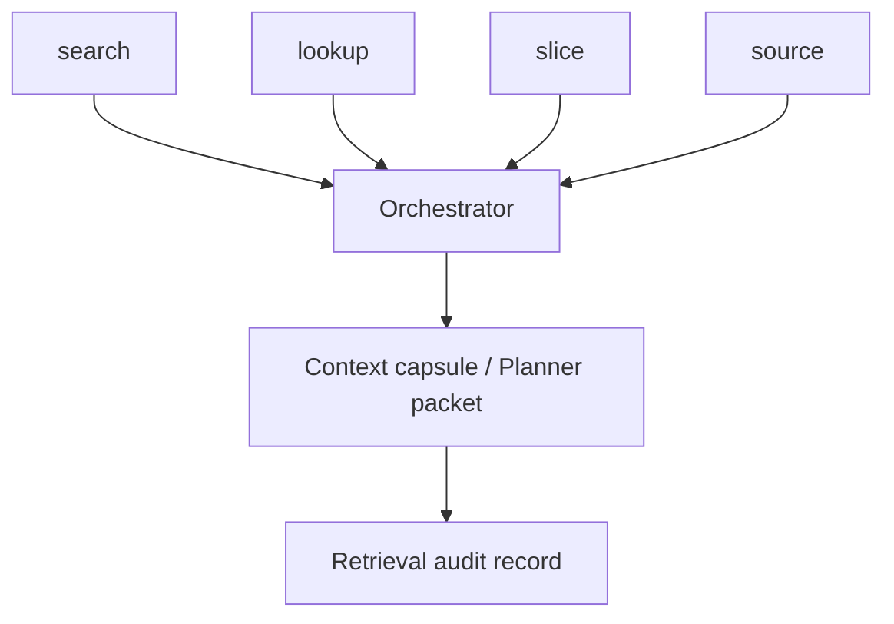

# Roadmap

## Overview

`my-dev-kit` is a CLI-first development context kit for indexing codebases, building graph artifacts, searching project structure, slicing relevant neighborhoods, and retrieving bounded source context for LLM-assisted development.

The product goal is simple: help developers understand large projects without reading whole files, broad folders, or unfiltered documentation — and to support downstream tools and LLM-assisted workflows with deterministic, bounded local artifacts.

The current release focuses on deterministic local artifacts:

- `symbol-index.json`
- `code-graph.json`
- optional call graph artifacts
- bounded source retrieval
- graph slices
- DOT, SVG, and PNG graph views
- deterministic keyword search over index artifacts

Future releases improve data-model understanding, frontend workflows, route and browser-state retrieval, source expansion, precision, scale, language coverage, and retrieval quality.

## Version 1.0.0

Version 1.0.0 is the first stable CLI release of `my-dev-kit`.

### Command surface

Version 1.0.0 includes six primary commands:

- `index`
- `lookup`
- `source`
- `slice`
- `view`
- `search`

### Implemented capabilities

#### Indexing

- TypeScript indexing
- JavaScript indexing
- Python indexing
- symbol extraction for functions, classes, constants, imports, exports, and source locations
- file-level graph nodes
- symbol-level graph nodes
- typed graph edges
- static call graph generation through `--call-graph`
- conservative TypeScript, JavaScript, and Python call extraction
- `symbol-index.json` output
- `code-graph.json` output

#### Lookup

- exact node lookup
- configurable graph depth
- file and symbol lookup support
- structured output for downstream tooling

#### Source retrieval

- line-range retrieval
- symbol-name retrieval
- node-ID retrieval
- bounded source extraction
- `json`, `plain`, and `numbered` output formats
- file output through `--out <path>`

#### Graph slicing

- bounded graph-neighborhood extraction
- focus-node slicing
- graph context suitable for prompt preparation
- typed node and edge output

#### Graph viewing

- Graphviz DOT output
- SVG output through Graphviz
- PNG output through Graphviz
- semantic edge styling
- labeled edge styling
- minimal edge styling
- graph legend support for semantic views

#### Search

- deterministic keyword search over index artifacts
- field-weighted ranking
- search over files, symbols, paths, and graph metadata
- retrieval-oriented candidate discovery

## Version 1.0.x

Version 1.0.x releases focus on release hardening, documentation quality, and safer retrieval workflows without changing the core artifact model.

### Large-repository safety

Planned improvements:

- default ignore rules for common generated folders
- `--exclude` support where missing
- `--dry-run` support for expensive commands
- progress reporting during indexing
- clearer output when a repository is large
- safer behavior when a command would scan too many files
- documentation for indexing large monorepos

### Retrieval workflow reporting

Planned improvements:

- report search queries used
- report selected candidate nodes
- report lookup targets
- report slice focus nodes
- report source nodes retrieved
- report source line ranges retrieved
- report fallback reason when line-range retrieval is used
- report fallback reason when a full-file read is recommended by an external coding agent

The graph-guided workflow should be easy to audit:

1. search candidate nodes
2. lookup the strongest nodes
3. slice around the strongest node or nodes
4. retrieve source by exact node or symbol
5. use line ranges only when symbol retrieval is not enough

### Documentation and examples

Planned improvements:

- clearer `README.md`
- clearer `QUICKSTART.md`
- clearer `COMMANDS.md`
- clearer graph-guided retrieval examples
- better examples for existing projects
- better examples for multi-root projects
- clearer explanation of generated artifacts
- clearer explanation of when to use each command
- removal of confusing or unused example scripts

## Version 1.1.0

Version 1.1.0 adds the first semantic integration layer on top of the existing code graph workflow.

### Implemented

#### Index-first semantic architecture

- `index` now runs semantic analyzers as part of the index run
- `manifest.json` is the authoritative artifact registry; it records all current artifact paths and analyzer status
- Stale artifacts from previous runs are removed when `index` refreshes the artifact directory
- Analyzer registry (`analyzers` array) in `manifest.json` records status, version, and artifact refs per analyzer

#### Semantic metadata contracts

- `semanticRoles` and `artifactRefs` arrays on symbols in `symbol-index.json`
- `semanticRoles` and `artifactRefs` arrays on symbol nodes in `code-graph.json`
- `evidenceRefs` collected from semantic roles for use in lookup output
- Semantic schema version `1.0.0` with defined role names

#### Data-model artifacts linked from index

- `data-model.json` and `data-model-graph.json` written by `index` when the TypeScript model analyzer produces output
- Artifact paths recorded in `manifest.json` under `semanticArtifacts`
- Compact `data-entity` and `data-field` roles embedded on qualifying symbols in index artifacts

#### Data-model extraction and inspection

- Conservative TypeScript model extraction for exported interfaces, type aliases, and classes
- Exact entity lookup by name or stable ID
- Exact field lookup by `Entity.field`
- `data-model.json`, `data-model-graph.json` as separate artifacts
- `data-model` command for focused inspection and regeneration

#### Conservative model-to-view lineage

- `model-view-lineage.json` produced in `data-model --trace-view` mode
- Conservative static lineage for supported transformation, view-model, component prop, and JSX rendering patterns
- `trace-view` mode for entity and field-level lineage

#### Semantic-aware commands

- `search`: indexes `semanticRole`, `semanticSubtype`, `semanticSource`, and `semanticArtifactRef` fields; returns semantic metadata on matched items
- `lookup`: returns `semanticRoles`, `artifactRefs`, and `evidenceRefs` from the focus node
- `slice`: preserves `semanticRoles` and `artifactRefs` on nodes in the slice output
- `source`: propagates `semanticRoles`, `artifactRefs`, and `evidenceRefs` from the symbol target

### Future work in this area

- Broader semantic role coverage: `route-handler`, `react-component`, `view-model`, `ui-only-state`, and others
- React and TSX semantic roles
- Browser storage and route roles
- Broader ORM and schema extractors (Prisma, SQL, TypeORM, Sequelize)
- Source retrieval expansion for semantic targets
- Graph visualization for data-model and lineage artifacts (DOT, SVG, PNG for `data-model-graph.json`)
- Analyzer profiles and selective analyzer runs
- Incremental indexing and scalability

## Version 1.2.0

Version 1.2.0 focuses on React, TSX, frontend test indexing, exact reference retrieval, and local React component-tree tracing.

The goal is to make frontend work retrievable by the structures developers actually use: components, props, hooks, JSX branches, visible text, routes, test names, locators, repeated literals, render-flow regions, and local prop/event flows.

### TSX and React indexing

Planned features:

- exported component indexing
- local component indexing
- prop type indexing
- local type indexing
- hook block indexing
- `useState` declaration indexing
- `useEffect` block indexing
- callback and event-handler indexing
- JSX branch indexing
- JSX section indexing
- important UI string indexing
- `data-testid` indexing
- ARIA label indexing
- local component-tree boundary indexing

Possible node examples:

- `component:apps/web/app/evidence-seed/page.tsx#EvidenceSeedPage`
- `handler:apps/web/app/evidence-seed/page.tsx#EvidenceSeedPage.handleRunIngestion`
- `state:apps/web/app/evidence-seed/page.tsx#evidenceRecordsVisible`
- `jsx:apps/web/app/evidence-seed/page.tsx#stage-3-evidence`
- `ui-string:apps/web/app/evidence-seed/page.tsx#Continue-to-evidence-review`

### React relationship extraction

Planned relationship types:

- component renders component
- component passes prop
- prop references handler
- handler sets state
- handler reads state
- state controls JSX branch
- effect restores state
- button invokes handler
- link points to target ID
- JSX anchor points to route or section
- tab value controls render branch
- render helper returns child component
- returned JSX passes props to child components
- parent component passes callback props to local child components
- local child component invokes callback props
- event handler updates state used by sibling or child components
- removed prop references are traceable across the local component tree

### React render-flow region retrieval

Planned features:

- retrieve state hook regions
- retrieve derived-state regions
- retrieve handler regions
- retrieve render helper functions
- retrieve conditional render branches
- retrieve returned JSX regions
- retrieve props passed to child components
- retrieve compact render-flow summaries for selected components

Candidate command shapes:

- `source --react-region <region> --file <path>`
- `source --react-flow <component-name>`
- `slice --node <component-node-id> --include-jsx-branches`

### Intra-file prop and event-flow tracing

Planned features:

- retrieve a local React component tree as a connected edit bundle
- trace parent component props
- trace local child component props
- trace callback props passed through local children
- trace event handlers such as `onClick`, `onMouseEnter`, `onFocus`, and `onBlur`
- trace state setters used by event handlers
- trace helper functions used to compute props
- trace all references to removed props to prevent orphaned references

Candidate command shapes:

- `trace-props --index <index-dir> --symbol <component-name>`
- `trace-events --index <index-dir> --symbol <component-name>`
- `source --index <index-dir> --symbol <component-name> --include-local-component-tree`
- `slice --index <index-dir> --node <component-node> --include-prop-flow --include-event-handlers`

### Test-file indexing

Planned features:

- `describe` block indexing
- `test` block indexing
- `it` block indexing
- `beforeEach` and `afterEach` indexing
- local test helper indexing
- Playwright route string indexing
- locator chain indexing
- visible text indexing
- test ID indexing

Candidate command shapes:

- `source --test-title <title>`
- `source --contains <exact-string>`
- `source --route <route>`
- `search --test-title <title>`
- `search --test-id <id>`

### Exact string, literal, and locator retrieval

Planned searchable targets:

- visible text
- route paths
- `data-testid` values
- ARIA labels
- placeholders
- button names
- link names
- locator expressions
- test titles
- page titles
- status labels
- tab IDs
- enum-like string literals
- repeated UI values
- browser storage keys

Candidate command shapes:

- `refs --literal <value>`
- `refs --symbol <symbol-name>`
- `source --contains <exact-string> --context <n>`

### Multi-location reference tracing

Planned features:

- find all occurrences of a literal across an indexed project
- find all occurrences of a literal inside one file or subsystem
- find references to a symbol or enum-like value when statically detectable
- group reference matches by file
- return bounded context around each match
- identify the nearest symbol, component, or React region when available
- distinguish declaration sites from usage sites where practical

## Version 1.3.0

Version 1.3.0 focuses on route-aware and browser-state-aware retrieval.

The goal is to help developers answer a practical frontend question: what code, state, test, and route are involved in making this UI visible?

### Route-aware indexing

Planned features:

- route path to page component relationships
- route path to API handler relationships
- page component to navigation call relationships
- route path to tests mentioning the route
- route path to UI links
- route path to access-policy entries when detectable
- route-centered graph slicing

Candidate command shapes:

- `search --route <route>`
- `slice --route <route>`
- `slice --route <route> --include-tests`
- `slice --route <route> --include-policy`

### Browser storage tracing

Planned features:

- session storage key indexing
- local storage key indexing
- read-site detection
- write-site detection
- clear-site detection
- storage key to component relationship
- storage key to route relationship
- storage key to artifact type relationship when detectable

Useful examples:

- `evidence-seed-artifact`
- `structured-content-bundle`
- `evidence-record-set`
- `evidence-review-snapshot`
- `evidence-graph-visualization-snapshot`
- `workspace-editor-draft.v1`

### UI reachability analysis

Planned features:

- report whether a component is imported
- report whether a component is rendered
- report whether rendering is conditional
- report which state gates a UI branch
- report which route reaches a component
- report which user action reaches it
- report which test proves it is visible
- flag components that are defined but not reachable

Candidate command shapes:

- `lookup --ui <component-or-string>`
- `slice --ui <component-or-string>`
- `view --route <route>`
- `search --storage-key <key>`

## Version 1.4.0

Version 1.4.0 focuses on source retrieval expansion.

The goal is to reduce full-file reads when the correct file, symbol, or component is already known.

### Source continuation

Planned features:

- continue retrieving a large symbol after the first bounded result
- retrieve the next source window from a known line
- make truncation recoverable without reading the whole file

Candidate command shapes:

- `source --node <symbol-id> --continue`
- `source --file <path> --symbol <name> --continue-from <line>`

### Local context expansion

Planned features:

- include imports for a retrieved symbol
- include local type definitions used by a retrieved symbol
- include local prop types used by a React component
- include local constants used by a symbol
- include local helper functions called by a symbol
- include local helper components used by a component
- include sibling source blocks when they are direct local dependencies

Candidate command shapes:

- `source --node <symbol-id> --include-imports`
- `source --node <symbol-id> --include-local-types`
- `source --node <symbol-id> --include-local-components`
- `source --node <symbol-id> --include-props`
- `source --node <symbol-id> --include-local-deps`
- `source --node <symbol-id> --expand-to-local-dependencies`

### Source bundle output

Planned features:

- bounded source bundles around one symbol
- local dependency closure with a max-line cap
- explanation for each included source block
- deterministic ordering of included blocks
- compact output suitable for coding-agent prompts

Candidate command shape:

- `source --node <symbol-id> --include-local-deps --max-lines <n>`

## Version 1.5.0

Version 1.5.0 focuses on schema and layer classification and prepares the context-report foundation that the future orchestration layer will use.

The goal is to help developers avoid editing the wrong layer by classifying symbols, types, and files by their role in the project. The classifications, edit/avoid/readiness categories, and risk labels produced here form the schema that the v1.6 orchestrator will use to assemble task-specific context capsules.

### Symbol and type classification

Planned classifications:

- canonical type
- artifact type
- database model
- projection type
- view model
- UI-only state
- test fixture
- persistence adapter
- route handler
- client component
- server component
- generated file
- configuration file

### Context report improvements

Planned report fields:

- what is reachable today
- what is defined but unused
- what is read-only
- what is editable
- what is guest-safe
- what is authenticated-only
- what is canonical state
- what is projection state
- what route or user action reaches each component
- files that are safe to modify first
- files that should be avoided for the task

### Readiness categories

Planned categories:

- `ready`
- `needs-more-context`
- `risky-assumption`
- `wrong-layer-risk`
- `unreachable-ui-risk`
- `requires-test-validation`
- `requires-browser-validation`

## Version 1.6.0: Orchestrator / Graph-Guided Planner Packets

Version 1.6.0 introduces the orchestration layer that turns search, lookup, slice, source, semantic artifacts, and source bundles into compact task-specific context capsules and retrieval audit records.

The goal is to make graph locality directly affect what context is retained for a coding task. The orchestrator selects, prunes, and packages retrieval results into bounded planner packets that downstream tools and developers can use without reading broad unrelated context.

### Graph-focused retrieval

Planned features:

- focus-node selection from ranked retrieval winners
- multi-seed graph focus when confidence is low
- subsystem-aware retrieval mode
- feature-add retrieval mode
- stronger ranking for sibling implementations
- stronger ranking for subsystem contracts
- stronger ranking for registries
- stronger ranking for local tests
- penalties for unrelated top-level files

### Planner packet pruning

Planned features:

- hard caps on candidate files
- hard caps on doc sections
- hard caps on source slices
- hard caps on graph nodes and edges
- graph-local file retention
- graph-local doc retention
- graph-local source-slice retention
- explicit explanation for retained and dropped entries

### Graph-first prompt packing

Planned features:

- prioritize graph-local code blocks
- prioritize graph-local doc sections
- prioritize graph-local source slices
- compress broad retrieval summaries when graph confidence is high
- omit broad context blocks when graph-local context is enough
- keep fallback behavior for low-confidence graph focus

## Version 1.7.0

Version 1.7.0 focuses on retrieval-quality regression benchmarks for validating the orchestrator and planner packets introduced in v1.6.

The goal is to make bounded-context quality testable and to confirm that the orchestrator selects the right context for representative coding tasks.

### Benchmark coverage

Planned benchmark task types:

- add a sibling implementation in a known subsystem
- modify a registry-driven feature
- update a route-level UI
- update a Playwright test by route
- modify a React component prop flow
- retrieve a session-storage workflow
- locate a hidden conditional render branch
- trace a repeated literal across a file or subsystem
- update a repeated tab value or enum-like string without reading the full file
- retrieve React render-flow regions without reading the full component file
- trace prop and event flow across a local React component tree
- remove a prop across local React child components without leaving orphaned references
- trace a data model field into a generated view model or rendered UI element
- distinguish canonical data-model usage from view-model or UI-only usage
- update a large TSX component without full-file retrieval
- distinguish canonical schema from projection schema
- retrieve data-model relationships for a schema-heavy project

### Assertions

Planned assertions:

- top-K retrieval quality
- graph-focus correctness
- planner packet size limits
- absence of unrelated generic files in top ranks
- source expansion correctness
- source continuation correctness
- exact string and reference tracing correctness
- React render-flow retrieval correctness
- intra-file prop and event-flow tracing correctness
- model-to-view lineage correctness
- canonical model versus view-model classification correctness
- no unnecessary full-file reads
- route, UI, and test coverage
- data-model graph correctness where applicable

### Metrics

Planned metrics:

- selected file count
- selected doc section count
- selected source slice count
- selected graph node count
- selected graph edge count
- reference match count
- React render-region retrieval coverage
- local component-tree retrieval coverage
- prop-flow and event-flow match count
- model-to-view lineage edge count
- rendered field usage count
- full-file reads avoided
- full-file reads allowed
- full-file reads unjustified
- fallback reason counts
- prompt-size reduction from graph-guided retrieval

## Version 1.8.0

Version 1.8.0 focuses on scalability and indexing ergonomics.

The goal is to make `my-dev-kit` more practical for larger repositories.

### Incremental indexing

Planned features:

- changed-file detection
- cache reuse
- partial index rebuild
- stable artifact IDs across rebuilds
- invalidation when configuration changes
- clear cache reset command

### Watch mode

Planned features:

- watch source roots
- rebuild changed files
- update affected graph artifacts
- report changed nodes and edges
- keep output deterministic

### Graph diff

Planned features:

- compare two index runs
- report added nodes
- report removed nodes
- report changed nodes
- report added edges
- report removed edges
- report changed edge metadata

### Search and lookup filtering

Planned features:

- filter search by node kind
- filter search by symbol kind
- filter search by edge kind
- filter lookup output by edge kind
- filter graph slices by node and edge kinds

## Version 1.9.0

Version 1.9.0 focuses on language and framework coverage.

The goal is to expand support while keeping static analysis conservative.

### Python improvements

Planned features:

- richer alias handling
- better cross-module call resolution
- better method-call resolution
- better class-member extraction
- better decorator metadata extraction
- better Django model extraction
- better SQLAlchemy model extraction

### JavaScript improvements

Planned features:

- improved JSDoc type extraction
- better CommonJS handling where practical
- better mixed JavaScript and TypeScript project support

### Framework improvements

Candidate framework targets:

- React
- Next.js
- Playwright
- Vitest
- NestJS
- Express
- FastAPI
- Django
- SQLAlchemy
- Prisma

### Additional language support

Candidate future languages:

- Go
- Rust
- Java
- C#
- Kotlin

Additional language support should be added through language adapters rather than hardcoded into one scanner.

## Version 2.0.0

Version 2.0.0 focuses on a larger artifact and plugin model.

The goal is to expand the v1 CLI into a more extensible retrieval platform while preserving the core graph-guided workflow.

### Artifact schema v2

Candidate first-class node types:

- file
- symbol
- local function
- React component
- local React component tree
- hook
- state variable
- JSX branch
- UI string
- test block
- route
- storage key
- literal reference
- enum or union value reference
- React render region
- prop flow
- event handler flow
- data entity
- data field
- view model
- transformation step
- rendered field
- model-to-view lineage edge
- artifact type
- database model
- projection type
- graph-local evidence bundle

### Plugin architecture

Candidate plugin categories:

- language plugins
- framework plugins
- test-framework plugins
- ORM plugins
- schema plugins
- graph-view plugins
- retrieval-ranking plugins

### Retrieval API

Candidate command groups:

- `search`
- `lookup`
- `slice`
- `source`
- `source-bundle`
- `refs`
- `trace-props`
- `trace-events`
- `route-map`
- `ui-reachability`
- `storage-trace`
- `schema-classify`
- `data-model`
- `model-lineage`
- `model-view-trace`
- `graph-diff`

### Compatibility

Version 2.0.0 includes a compatibility plan for v1 artifacts.

If artifact formats change, the release provides one of the following:

- a migration command
- a compatibility reader
- a documented version boundary
- a clear artifact regeneration path

## Long-term direction

`my-dev-kit` should remain local-first, deterministic, and inspectable.

The core product direction is:

- compact structural artifacts instead of raw context dumps
- graph-guided retrieval instead of full-file reads
- bounded source context instead of broad source injection
- model-to-view lineage instead of manual tracing from schemas to generated UI
- literal and reference tracing instead of full-file string hunting
- React render-flow retrieval instead of full-component reading
- local React prop and event-flow tracing instead of full-file component-tree reading
- explicit fallback reporting instead of hidden assumptions
- conservative static analysis instead of overclaimed runtime understanding
- framework-aware retrieval where it improves real development workflows
- clear artifacts that can be inspected, versioned, and reused by humans or coding agents

The product should continue to work as a standalone CLI. Any future UI, hosted service, or agent integration should build on the same artifact model rather than replacing it.