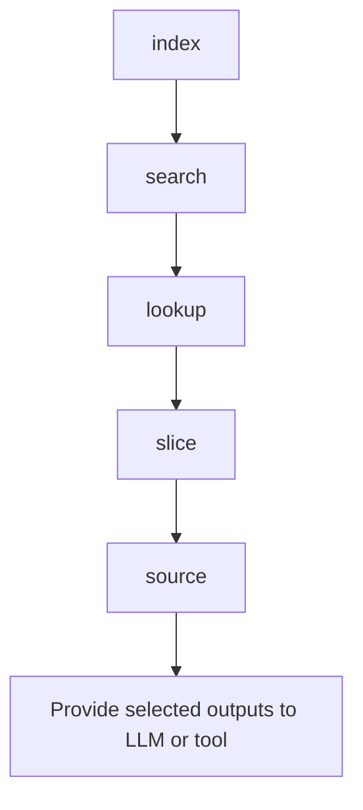

# Workflows

Practical usage workflows for my-dev-kit. For the full flag reference, see [COMMANDS.md](COMMANDS.md). For artifact and schema details, see [GRAPH_SCHEMA.md](GRAPH_SCHEMA.md).

## Ecosystem docs first

For any task involving my-dev-kit, my-dev-kit-orchestrator, my-dev-kit-lab, coding-agent workflows, prompt templates, release workflows, audits, experiments, or documentation reconciliation, inspect the local ecosystem docs first:

- `docs/ecosystem/TOOL_ECOSYSTEM_REFERENCE.txt`
- `docs/ecosystem/WORKFLOW_PROMPT_ASSEMBLY_RULES.txt`

These files define the shared tool boundaries, command expectations, and prompt assembly rules for the local ecosystem.

## Overview

The recommended usage pattern:

1. Run `index` into `.my-dev-kit`. Re-run `index` to refresh the artifact directory when source changes. Do not create a new index folder for every run unless you are deliberately taking a snapshot.
2. Use `search` to discover relevant node IDs, including by semantic role when available.
3. Use `lookup` to inspect exact nodes and their semantic metadata.
4. Use `slice` to inspect graph neighborhoods while preserving semantic metadata on nodes.
5. Use `source` to retrieve specific code excerpts.
6. Use `data-model` for entity, field, and trace-view tasks when data-model artifacts are present.
7. Use `view` to render the code graph as DOT, SVG, or PNG when a visual overview is needed.

Do not start by reading the full graph or full source tree. Use `search` first to narrow the context.

---

## Workflow 1: Index a TypeScript or JavaScript project

Run `index` from the project root:

```sh
npx @dailephd/my-dev-kit index --root . --src src --out .my-dev-kit --json
```

The `--out` path is relative to `--root`. The above creates or refreshes `.my-dev-kit/`.

Re-run the same command to refresh the artifact directory when source changes. The directory is updated in place and stale artifacts are removed.

Include a call graph:

```sh
npx @dailephd/my-dev-kit index --root . --src src --out .my-dev-kit --call-graph --json
```

Index multiple source roots:

```sh
npx @dailephd/my-dev-kit index --root . --src src --src tests --out .my-dev-kit --json
```

For large monorepos, avoid indexing broad roots that contain application output, dependency folders, caches, or generated artifacts. Target the source folders that matter for the current workflow:

```sh
npx @dailephd/my-dev-kit index --root . --src apps/web/app --src apps/web/lib --src apps/web/prisma --out .my-dev-kit-web --call-graph --json
```

npx @dailephd/my-dev-kit skips common generated, dependency, cache, and build directories by default, including `node_modules`, `.next`, `dist`, `build`, `coverage`, `playwright-report`, `test-results`, `output`, `out`, `.cache`, `.turbo`, `.vercel`, `.git`, `.pytest_cache`, `__pycache__`, `.venv`, and `venv`. Add project-specific exclusions with repeated `--exclude` values:

```sh
npx @dailephd/my-dev-kit index --root . --src apps/web --out .my-dev-kit-web --exclude .next --exclude coverage --exclude apps/web/generated --json
```

Use `--dry-run` before indexing a large tree, and add `--progress` when you want phase and count diagnostics. Progress is written to stderr and does not corrupt JSON stdout.

```sh
npx @dailephd/my-dev-kit index --root . --src apps/web --out .my-dev-kit-web --dry-run --json
npx @dailephd/my-dev-kit index --root . --src apps/web/app --src apps/web/lib --out .my-dev-kit-web --progress --json
```

Split indexes can keep focused workflows faster and easier to inspect:

```sh
npx @dailephd/my-dev-kit index --root . --src apps/web/app --src apps/web/lib --src apps/web/prisma --out .my-dev-kit-web --call-graph --json
npx @dailephd/my-dev-kit index --root . --src apps/web/tests --src apps/web/e2e --out .my-dev-kit-web-tests --exclude playwright-report --exclude test-results --json
npx @dailephd/my-dev-kit index --root . --src apps/nlp-service/src --language python --out .my-dev-kit-nlp --call-graph --json
npx @dailephd/my-dev-kit index --root . --src scripts --out .my-dev-kit-scripts --json
```

---

## Workflow 2: Index a Python project

Python indexing requires `python` or `python3` on `PATH` with Python 3.8 or later. The `--language python` flag selects Python mode. Language can also be inferred from `.py` file extensions.

**Step 1: Index the Python source root**

```sh
npx @dailephd/my-dev-kit index --root . --src src --language python --out .my-dev-kit --json
```

Include a static call graph when call edges are useful:

```sh
npx @dailephd/my-dev-kit index --root . --src src --language python --out .my-dev-kit --call-graph --json
```

**Step 2: Search for Python symbols**

```sh
npx @dailephd/my-dev-kit search --index .my-dev-kit --query "greet" --limit 20 --json
```

**Step 3: Look up a Python node**

```sh
npx @dailephd/my-dev-kit lookup --index .my-dev-kit --node file:src/main.py --depth 1 --json
```

**Step 4: Retrieve Python source**

```sh
npx @dailephd/my-dev-kit source --index .my-dev-kit --file src/main.py --symbol greet --format numbered
```

Use line-range retrieval for exact bounds:

```sh
npx @dailephd/my-dev-kit source --index .my-dev-kit --file src/main.py --start 1 --end 40 --format numbered
```

**Python notes:**

- Call-graph extraction is static and conservative. It uses `ast` parsing and may miss dynamic calls.
- If no Python interpreter is found on `PATH`, Python files are skipped with a warning in the manifest.

---

## Workflow 3: Graph-Guided Symbol Retrieval

Graph-Guided Symbol Retrieval is the recommended approach when navigating an unfamiliar codebase. It avoids broad file reading by narrowing context progressively from keyword search to exact graph nodes to targeted source excerpts.

**Step 1: Index the project**

```sh
npx @dailephd/my-dev-kit index --root . --src src --out .my-dev-kit --json
```

**Step 2: Search to narrow candidates**

```sh
npx @dailephd/my-dev-kit search --index .my-dev-kit --query "<relevant term>" --limit 20 --json
```

Inspect `nodeId`, `kind`, and `matchReasons` in the results. Prefer symbol nodes when the target is a specific function, class, or type. When semantic metadata is present, result items include `semanticRoles` and `artifactRefs`, and match reasons may include `semanticRole` as a contributing field.

**Step 3: Look up the strongest candidate**

```sh
npx @dailephd/my-dev-kit lookup --index .my-dev-kit --node "<node-id>" --depth 1 --json
```

Review incoming edges, outgoing edges, and neighbors to understand the node's relationships. Repeat for adjacent nodes as needed.

**Step 4: Slice around the focus node**

```sh
npx @dailephd/my-dev-kit slice --index .my-dev-kit --node "<node-id>" --depth 2 --direction both --json
```

The slice provides a bounded subgraph view that is easier to reason about than the full graph.

**Step 5: Retrieve source for specific symbols**

Use symbol-mode retrieval when possible:

```sh
npx @dailephd/my-dev-kit source --index .my-dev-kit --file "<path>" --symbol "<symbol-name>" --format numbered
```

Use line-range retrieval when symbol-mode is too broad or incomplete:

```sh
npx @dailephd/my-dev-kit source --index .my-dev-kit --file "<path>" --start <n> --end <n> --format numbered
```

**What to avoid:**

- Do not read full `code-graph.json` manually to find node IDs. Use `search` first.
- Do not retrieve large line ranges when a symbol name is known. Use `--symbol` mode first.
- Do not iterate all files before searching. Let `search` narrow the scope.

---

## Workflow 4: Generate graph visualization

DOT output does not require Graphviz:

```sh
npx @dailephd/my-dev-kit view --index .my-dev-kit --format dot --out .my-dev-kit/graph.dot
npx @dailephd/my-dev-kit view --index .my-dev-kit --format dot --edge-style labeled --out .my-dev-kit/graph.labeled.dot
npx @dailephd/my-dev-kit view --index .my-dev-kit --format dot --edge-style minimal --out .my-dev-kit/graph.minimal.dot
```

SVG output requires Graphviz:

```sh
npx @dailephd/my-dev-kit view --index .my-dev-kit --format svg --out .my-dev-kit/graph.svg
```

Fall back to DOT if Graphviz is unavailable:

```sh
npx @dailephd/my-dev-kit view --index .my-dev-kit --format svg --allow-dot-fallback --out .my-dev-kit/graph.dot
```

Use `--format dot` for automated checks. Reserve SVG or PNG for interactive review.

---

## Workflow 5: Use my-dev-kit output with an LLM or downstream tool

LLM-assisted development works best when the model receives bounded, relevant context rather than whole files or broad project dumps. my-dev-kit helps collect that context deterministically from your local project.

npx @dailephd/my-dev-kit does not call any LLM or external service, does not edit files, and does not act as an autonomous agent. It produces local bounded artifacts that you can provide to an LLM conversation, a coding assistant, or any downstream tool.



**Command sequence**

```sh
npx @dailephd/my-dev-kit index --root . --src src --out .my-dev-kit --json
npx @dailephd/my-dev-kit search --index .my-dev-kit --query "<topic>" --limit 20 --json
npx @dailephd/my-dev-kit lookup --index .my-dev-kit --node "<node-id>" --depth 1 --json
npx @dailephd/my-dev-kit slice --index .my-dev-kit --node "<node-id>" --depth 2 --direction both --json
npx @dailephd/my-dev-kit source --index .my-dev-kit --file "<path>" --symbol "<symbol-name>" --format numbered
```

**Recommended outputs to provide**

- Selected search results or a concise summary of the strongest matches
- Selected lookup output
- Selected graph slice or a concise summary of nearby nodes and edges
- Numbered source excerpts with file paths and symbol names

**What to omit**

- The entire source tree
- Full `symbol-index.json` or `code-graph.json`
- Broad unrelated files
- Generated artifacts not relevant to the current task

**When to rerun commands**

- Re-run `index` after source changes so graph artifacts match the current project.
- Refine the `search` query if results are weak. Try symbol names, feature terms, error text, file names, or imported module names.
- Use `lookup --depth 1` first. Increase depth only when the immediate graph neighborhood is insufficient.
- Use `slice --depth 1` or `slice --depth 2` depending on context size.
- Use line-range source retrieval when symbol retrieval is too broad or incomplete.

---

## Workflow 6: Source continuation and local dependency expansion (v1.4.0)

When the initial bounded preview is not enough, continue reading or expand to same-file dependencies instead of reading the whole file.

```sh
npx @dailephd/my-dev-kit source --index .my-dev-kit --file src/editor.ts --symbol EditorShell --continue
npx @dailephd/my-dev-kit source --index .my-dev-kit --file src/editor.ts --symbol EditorShell --include-local-deps --format numbered
```

JSON output includes a `continuationCursor` (`nextStartLine`, `previousEndLine`, `exhausted`, `reason`). Numbered output prints a `[CONTINUE: ...]` or `[EOF: ...]` footer. Expansion (`--include-imports`, `--include-local-types`, `--include-props`, `--include-local-components`, `--include-local-deps`) is static-analysis only: direct, same-file dependencies — no cross-file closure, no runtime tracing.

## Workflow 7: Data-model and model-to-view lineage inspection

```sh
npx @dailephd/my-dev-kit data-model --index .my-dev-kit --entity User --json
npx @dailephd/my-dev-kit data-model --index .my-dev-kit --field User.email --json
npx @dailephd/my-dev-kit data-model --index .my-dev-kit --trace-view User --json
```

`trace-view` is conservative static evidence only: direct transformation functions, direct view-model assignments, direct component prop assignments, and direct JSX rendering where field identity remains explicit. It does not claim route-aware reachability, browser-state behavior, or runtime rendering behavior.

## Workflow 8: Context capsule and retrieval audit (v1.6.0)

Produce a bounded, deterministic context capsule for a task-like query, with an optional full retrieval audit trail:

```sh
npx @dailephd/my-dev-kit context --index .my-dev-kit --query "<task description>" --mode feature-add --out context-capsule.json --json
npx @dailephd/my-dev-kit context --index .my-dev-kit --query "<task description>" --out context-capsule.json --audit-out retrieval-audit-record.json --json
```

`--mode` is one of `general` (default), `feature-add`, or `subsystem`, and adjusts candidate ranking deterministically. Use `--no-source` to suppress source slices/bundles while retaining graph and metadata evidence. The capsule never embeds a raw graph or artifact dump — evidence is bounded and reason-tagged. See [GRAPH_SCHEMA.md](GRAPH_SCHEMA.md) for the full schema.

## Workflow 9: Compare two index snapshots with graph-diff (v1.8.0)

```sh
npx @dailephd/my-dev-kit index --root . --src src --out .my-dev-kit-before --json
# ... make source changes ...
npx @dailephd/my-dev-kit index --root . --src src --out .my-dev-kit-after --json
npx @dailephd/my-dev-kit graph-diff --before .my-dev-kit-before --after .my-dev-kit-after --json
```

`graph-diff` never runs `index` and never modifies either input directory; it reports added/removed/changed nodes, edges, and artifact metadata using each artifact's existing stable IDs. Exit code is `0` for any valid comparison (with or without differences).

## Workflow 10: Index and retrieve Android/Kotlin/Java projects (v1.10.0)

```sh
npx @dailephd/my-dev-kit index --root . --src app/src/main/java --src app/src/main/kotlin --out .my-dev-kit --json
npx @dailephd/my-dev-kit search --index .my-dev-kit --query "ViewModel" --limit 20 --json
npx @dailephd/my-dev-kit lookup --index .my-dev-kit --node "<node-id>" --depth 1 --json
npx @dailephd/my-dev-kit search --index .my-dev-kit --android-route home --json
npx @dailephd/my-dev-kit search --index .my-dev-kit --permission android.permission.CAMERA --json
npx @dailephd/my-dev-kit search --index .my-dev-kit --resource string/app_name --json
npx @dailephd/my-dev-kit lookup --index .my-dev-kit --android-component com.example.MainActivity --json
npx @dailephd/my-dev-kit source --index .my-dev-kit --android-route home --json
npx @dailephd/my-dev-kit slice --index .my-dev-kit --android-component com.example.MainActivity --depth 2 --json
npx @dailephd/my-dev-kit view --index .my-dev-kit --graph android-navigation --format dot
```

`.kt` and `.java` files under `--src` are indexed like any other language — no new flags. When Android project evidence (`settings.gradle(.kts)`, `AndroidManifest.xml`, source-set layout) is found under `--root`, `index` also writes `android-project.json`, and when Android component roles (Activity, Fragment, ViewModel, Service, Repository, Room entities/DAOs, Retrofit services, Hilt modules, and others) are detected on indexed Kotlin/Java symbols, `index` writes `android-components.json` and attaches compact `androidComponentRoles`/`androidComponentRefs` metadata usable through `search`, `lookup`, `source`, `slice`, `context`, and `graph-diff`. This is conservative static evidence only: it never executes Gradle, javac, or the Kotlin compiler, and does not validate Android runtime behavior, manifest registration, Compose semantics, or Android security posture.

Android projects additionally produce `android-gradle.json`, `android-manifest.json`, `android-resources.json`, and `android-navigation.json` when the applicable static evidence exists. Android artifact-backed nodes and candidate relationships enrich the existing `code-graph.json`; there is no `android-relationships.json`. Android selectors use exact matching and preserve ambiguity; route/resource source is bounded, binary resources are not decoded, and `android-module`, `android-manifest`, and `android-navigation` views render real graph edges only. This remains static analysis: it does not build Android projects, resolve dependencies, merge manifests, select resources, prove runtime behavior, provide full Compose semantics, or perform Android security validation.

## Workflow 11: Stage-role context refresh (v1.10.1)

Version 1.10.1 introduced this shipped role-aware workflow. It uses the existing `index` and `context` architecture at three points rather than reusing one early capsule for every stage. v1.10.3 (shipped) also gives the capsule and retrieval audit one grounded repository/index identity and validates their shared contract before successful output, without changing the workflow or CLI syntax.

Use a role directly:

```sh
npx @dailephd/my-dev-kit context --index .my-dev-kit --query "locate the context extension point" --role architecture --out .my-dev-kit/architecture-context.json --json
```

Or provide a structured request:

```sh
npx @dailephd/my-dev-kit context --request context-request.json --json
```

`role` and `mode` are independent. Refresh the index when the source state changes, and inspect `freshness`, `roleAdequacy`, `truncation.requiredEvidenceLost`, condition-specific missing/blocking conditions, unresolved evidence, provenance, and the matching capsule/audit `index.projectRoot` before using the result. General `truncation.truncated` alone is not a readiness verdict: optional bounded overflow may coexist with adequate context. Do not hand-edit either generated artifact; regenerate the pair from the same request and validated index.

### Architecture-stage flow

1. Index or refresh the repository using the existing `index` command.
2. Retrieve architecture-role context for the request.
3. Inspect ownership ambiguity, structural evidence, adequacy, truncation, and provenance.
4. Use the evidence to identify the extension point and avoid parallel architecture.

The primary question is: "Where should the behavior live?"

### Implementation-stage flow

1. Refresh the index immediately before production editing.
2. Retrieve implementation-role context rather than relying only on the earlier architecture capsule.
3. Inspect exact owners/source, dependencies, callers/callees, validators/constants/defaults/limits/errors, serializers/schemas/command parsing, compatibility surfaces, generated-output contracts, and closest tests. A structurally grounded owner needs request relevance plus independent structural support; a focused or owner-named file is not enough by itself.
4. Inspect allocation and role-condition diagnostics. Unused reservation can be borrowed by another group; after the finite aggregate bound is exhausted, omitted surplus candidates remain visible as optional truncation when the required owner and contract witnesses are still covered.
5. Stop when `roleAdequacy` is insufficient, `requiredEvidenceLost` is true, a required condition is missing, context is stale, or freshness is unknown where the workflow requires proof. Do not stop solely because optional truncation is present.
6. Implement production code outside my-dev-kit context generation.

The primary question is: "What exact current code must be changed or preserved?"

### Test-implementation-stage flow

1. After production changes, refresh the index again.
2. Collect changed production files/symbols from the implementation report, caller input, or before/after `graph-diff` evidence.
3. Retrieve test-implementation context using caller-supplied stable test-responsibility IDs. Repeated IDs produce one mapping in first-occurrence order plus an explicit duplicate diagnostic; duplicate and unknown/unmapped diagnostics are independent.
4. Inspect changed symbols, validators/constants/errors, failure and side-effect boundaries, related tests, fixtures/factories/mocks/setup/configuration, package scripts, exact commands, and responsibility mappings.
5. Stop if critical responsibilities are unmapped or the changed surface/test infrastructure is inadequate.
6. Implement tests outside context generation and then run verification.

The primary question is: "How should approved test responsibilities be implemented against final production code?"

### Orchestrator and lab boundary

The current orchestrator does not automatically run my-dev-kit and does not expose implementation-context or test-context as native stages. Initial my-dev-kit-orchestrator integration is prompt-guided: existing implementation and test-implementation stages require the manual refresh and reference supplemental context artifacts. Workflow catalogs, instruction packets, TaskState, prompts, lifecycle, stage order, judge/correction handling, and freshness policy remain orchestrator-owned. The producer correction documented here does not implement orchestrator readiness reconciliation, recovery routing, judge enforcement, or final-report enforcement.

my-dev-kit-lab may run controlled comparisons of full/bounded workflow instructions and architecture/implementation/test refresh strategies, then measure size, explicit evidence recall, irrelevant inclusion, mapping completeness, provenance, determinism, truncation/inadequacy, and target immutability. The lab does not become a required production workflow component, and this producer patch does not implement lab-side producer/orchestrator agreement or judge/final-report integrity validation.

Request-file syntax and role contracts are documented in [COMMANDS.md](COMMANDS.md). Legacy invocations without `--role` or `--request` remain compatible.

---

## Workflow 12: Compose semantic retrieval (v1.11.0)

For an Android project with Jetpack Compose UI, `index` also writes `android-compose-semantic.json`: composable declarations (Batch 1), state/effect/ViewModel/test-tag/visible-text/string-resource facts (Batch 2), and click-handler/navigation-call facts cross-referenced to `android-navigation.json` (Batch 3) — all conservative static evidence, attached to the innermost enclosing composable, never a runtime rendering or reachability claim.

That evidence is projected into `code-graph.json` as compact `android-composable`/`android-compose-fact` nodes, retrievable through the same commands as any other Android evidence:

```sh
npx @dailephd/my-dev-kit search --index .my-dev-kit --composable "HomeScreen" --json
npx @dailephd/my-dev-kit search --index .my-dev-kit --test-tag "login_button" --json
npx @dailephd/my-dev-kit search --index .my-dev-kit --android-ui "Welcome back" --json

npx @dailephd/my-dev-kit source --index .my-dev-kit --composable "HomeScreen" --format numbered
npx @dailephd/my-dev-kit source --index .my-dev-kit --composable "HomeScreen" --include-compose-tree --max-bundle-lines 200 --format json

npx @dailephd/my-dev-kit slice --index .my-dev-kit --composable "HomeScreen" --include-viewmodel --include-navigation --depth 2 --json
```

`--composable`, `--android-ui`, and `--test-tag` are exact-match only and mutually exclusive with the other selectors; zero matches returns `not-found`, more than one returns `ambiguous` with every candidate — never a picked winner. `--include-compose-tree` (requires `--composable`) returns a bounded, capped, deterministic root-first bundle of the composable and its reachable children, the same bundle/cap contract `--include-local-component-tree` already uses for React. `--include-viewmodel`/`--include-navigation` (both require slice `--composable`) extend the normal depth-bounded slice to directly-resolved ViewModel candidates and navigation-call route candidates respectively — no repository/data-flow expansion. Composable and fact evidence also participates in plain `search --query`, `context`, and exact `lookup --node` automatically, with no new flags needed there.

This remains static analysis: no claim is made that a composable renders, a child composable is displayed, a click occurs, navigation succeeds, a route is reachable, a ViewModel is scoped correctly, or a string resource resolves to on-screen text. Compose graph views are not implemented yet.

## Workflow 13: Android test-evidence retrieval (v1.11.0 Batch 5)

For an Android project with `test`/`androidTest` source sets, `index` also writes `android-test-semantic.json`: test classes/methods, JUnit4/JUnit5/lifecycle annotations, Compose test rules, visible-text/test-tag assertions, route references, and fake/mock test-double evidence — discovered only under `android-project.json`'s already-detected `test`/`androidTest` roots (never a repository-wide scan, never added to `symbol-index.json`), and exact-matched against production Compose/navigation/ViewModel evidence.

That evidence is projected into `code-graph.json` as compact `android-test-file`/`android-test-class`/`android-test-method`/`android-test-fact` nodes. No new selector flags exist for it — it is retrievable through the exact same generic commands as any other indexed evidence:

```sh
npx @dailephd/my-dev-kit search --index .my-dev-kit --query "HomeScreenTest" --json
npx @dailephd/my-dev-kit search --index .my-dev-kit --query "login_button" --json

npx @dailephd/my-dev-kit lookup --index .my-dev-kit --node "android-test-method:app/src/androidTest/kotlin/com/example/HomeScreenTest.kt#HomeScreenTest.showsLoginButton" --json
npx @dailephd/my-dev-kit source --index .my-dev-kit --node "android-test-method:app/src/androidTest/kotlin/com/example/HomeScreenTest.kt#HomeScreenTest.showsLoginButton" --format numbered
npx @dailephd/my-dev-kit slice --index .my-dev-kit --node "android-test-method:app/src/androidTest/kotlin/com/example/HomeScreenTest.kt#HomeScreenTest.showsLoginButton" --depth 2 --direction both --json
```

A test-method slice naturally includes real edges (`android-test-references-composable`, `android-test-references-route`, `android-test-references-viewmodel`, `android-test-uses-double`) whenever the test statically references production evidence — zero, one, or every ambiguous candidate is preserved, never a guessed winner. `graph-diff` reports added/removed/changed test nodes and edges the same way it reports any other code-graph change, with no dedicated diff section.

This remains static analysis: indexing never executes a test, launches an Activity, or proves an assertion passed, a mock was injected, or a Compose rule initialized at runtime. Android UI-test graph views (`view --graph android-test`) are not implemented yet.

---

## Bundled examples

The examples are for cloned repositories, documentation writers, and package smoke tests. Normal npm users should run my-dev-kit inside their own project.

```sh
npx @dailephd/my-dev-kit index --root examples/basic-ts --src src --out .my-dev-kit --json
npx @dailephd/my-dev-kit search --index examples/basic-ts/.my-dev-kit --query "service" --limit 5 --json

npx @dailephd/my-dev-kit index --root examples/basic-python --src src --language python --out .my-dev-kit --json
npx @dailephd/my-dev-kit search --index examples/basic-python/.my-dev-kit --query "greet" --limit 5 --json
```

---

## Troubleshooting

**Problem: "Missing index manifest"**
The index artifact directory does not contain `manifest.json`. Run `index` first, or check the `--index` path.

**Problem: "Unknown node ID"**
The node ID passed to `lookup`, `source`, or `slice` is not in the graph. Use `search` to discover valid node IDs.

**Problem: "Symbol not found"**
The symbol name does not match any indexed symbol in the specified file. Run `search --query <symbol-name>` to confirm spelling and which file contains it.

**Problem: "Graphviz dot executable is not available"**
SVG and PNG rendering requires Graphviz. Install Graphviz, use `--format dot`, or add `--allow-dot-fallback`.

**Problem: Result content is capped with a preview warning**
Symbol retrieval is bounded from the start line. Increase `--max-lines` or use line-range mode with explicit `--start` and `--end` values.

**Problem: Python symbols not indexed or warnings about Python interpreter**
Python indexing requires `python` or `python3` on `PATH`. Install Python 3.8 or later and ensure the interpreter is accessible.
